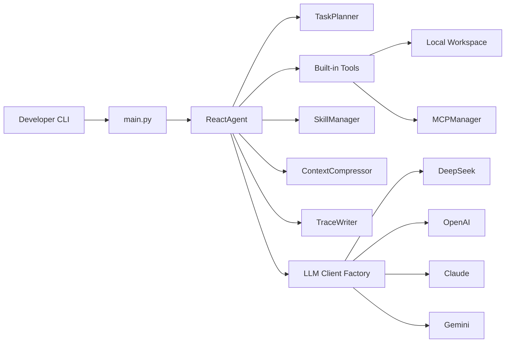

# DM-Code-Agent

<div align="center">

**本地优先、可审计、有算法骨架的 Python Code Agent**

[](https://github.com/hwfengcs/DM-Code-Agent/actions/workflows/ci.yml)
[](https://www.python.org/downloads/)
[](LICENSE)
[](MCP_GUIDE.md)
[](docs/tracing.md)
[](docs/research-log/01-swebench-baseline.md)
[](docs/research-log/)

**中文** | [English](README_EN.md) | [Français](README_FR.md)

</div>

> **一句话**：DM-Code-Agent 是一个把 ReAct + Planner + Replan + Trace 写在 ~1500 行可读 Python 里的代码维护 Agent，正在升级到 v2 算法栈（Reflexion / Hybrid RAG / Critic / Self-Consistency / Adaptive Replan），并接入 SWE-bench Lite 评测链路。
>
> 它不是要做又一个聊天黑盒，而是要做一个开发者能看懂、能复现、能扩展、能拿来对比研究的 Code Agent baseline。

## Why this project

- **可审计 (Auditable)**：每一步的计划、工具调用、观察结果都写入 JSONL trace，trace 自带 dry replay 与显式 tool replay，调试不靠"再问一次模型"。
- **可对标 (Benchmarked)**：项目自带 coding 与 maintenance 两套 hidden-test benchmark，并已发布 SWE-bench Lite DeepSeek Tier-1 baseline：0.0% resolved / 72.0% patch-applied on the fixed 50-instance subset。这个 Tier-1 数字受 host verifier 环境噪声影响，不能和官方 leaderboard 直接比较；所有 ablation 数据都附 raw JSON 报告，能复现。
- **有算法 (Algorithmic, v2)**：不是"调用 GPT-4 并写个 ReAct"。Reflexion、Hybrid RAG、Critic、Self-Consistency、Adaptive Replanning 各自模块化、各自有 ablation 实验。看 `docs/research-log/` 可读到每个决策的来由与翻车数据。
- **可扩展 (Extensible)**：内置 Skill 系统 + MCP 集成，任务激活领域 prompt 与专用工具；4 家主流 LLM 适配（DeepSeek/OpenAI/Claude/Gemini），可加自定义 `base_url`。

## v.s. 同类项目（v2 完成后将填入实测数据）

| 维度 | DM-Code-Agent | Aider | OpenHands | SWE-agent | smolagents |
| --- | --- | --- | --- | --- | --- |
| 本地优先（无沙箱依赖） | ✅ | ✅ | docker | docker | ✅ |
| Trace + Replay | ✅ JSONL + dry/tool replay | git diff | server log | trajectory | 弱 |
| Reflexion / Critic / Self-Consistency | ✅ v2 | ❌ | partial | ❌ | ❌ |
| Hybrid BM25+Embedding RAG | ✅ v2（opt-in） | repo-map | partial | retrieval | ❌ |
| MCP 集成 | ✅ | ❌ | ✅ | ❌ | ❌ |
| 自带 maintenance benchmark | ✅ 5+ tasks | ❌ | ❌ | SWE-bench | ❌ |
| 公开 SWE-bench Lite 分数 | ⚠️ Tier-1：0.0%（50/300 子集，非官方口径） | ❌ | ✅ | ✅ | ❌ |
| 代码体积（核心 LOC） | ~1500 | ~10k | ~50k | ~5k | ~3k |
| License | MIT | Apache-2.0 | MIT | MIT | Apache-2.0 |

> 表中的 SWE-bench Tier-1 baseline 已在 P1 落地；leaderboard-comparable 分数需要 Tier-2 Docker verifier，v2 Phase 2-5 会继续补齐 ablation 实测数据。
> 进度见 [docs/research-log/](docs/research-log/) 与 [CHANGELOG.md](CHANGELOG.md)。

## Algorithm Highlights（v2 路线图）

| 模块 | 状态 | 说明 | Devlog |
| --- | --- | --- | --- |
| ReAct + Planner + Replan | ✅ v1.5 | 基础 ReAct 循环 + 3-8 步全局计划 + 失败 replan | [00](docs/research-log/00-kickoff.md) |
| SWE-bench Lite suite | ✅ P1 | 50 题子集，DeepSeek Tier-1 baseline：0.0% resolved / 72.0% patch-applied；含失败模式分析并已说明 host verifier 噪声 | [01](docs/research-log/01-swebench-baseline.md) |
| Reflexion (episodic memory) | 🔄 P2 | 失败 trial 反思 → lesson → 注入下一次 prompt，支持 pass@k | 02（即将发布） |
| Hybrid RAG (BM25 + embeddings + RRF) | 🔄 P3 | 函数粒度索引、双路召回、Top-K 注入 prompt | 03（即将发布） |
| Critic + Self-Consistency | 🔄 P4 | 独立 LLM 同行评审 + N-候选选优（majority vote / critic score / test pass） | 04（即将发布） |
| Adaptive Replanning + Token economics | 🔄 P5 | 错误类型 → replan 策略，跨模型 cost-per-success 表 | 05（即将发布） |

## Research Log

DM-Code-Agent 的每个非平凡设计决策都会留下 devlog：动机、实验、ablation、踩坑、下一步。
入口：[`docs/research-log/`](docs/research-log/)。已发布：

- [00 — Kickoff: Why a v2 algorithm-track upgrade?](docs/research-log/00-kickoff.md)
- [01 — SWE-bench Lite baseline: harness, sampling, and the road to numbers](docs/research-log/01-swebench-baseline.md)

---

DM-Code-Agent 是一个面向真实代码维护任务的轻量 Code Agent。它在本地工作区中运行，能够调用文件、搜索、测试、lint、代码分析和 MCP 工具，并把每一步计划、工具调用、观测结果和最终报告记录为可审计 trace。

它的目标不是做一个黑盒聊天机器人，而是做一个开发者可以检查、复现、评测和扩展的代码维护助手。

## 适合做什么

- 修复小到中等规模的 bug，并运行测试验证。
- 补充回归测试，避免只修 visible case。
- 分析项目结构、函数签名、依赖和代码指标。
- 执行小型重构或文档一致性修复。
- 生成 trace 和 benchmark 报告，用于审计 agent 的行为质量。

## 核心能力

| 能力 | 说明 |
| --- | --- |
| ReAct Agent | 模型输出 `thought/action/action_input`，Agent 执行工具并把 observation 写回上下文 |
| Task Planner | 执行前生成 3-8 步计划，失败后可触发 replan |
| Tool System | 文件读写、搜索、Python/Shell 执行、测试、lint、AST、代码指标 |
| Code Index | 扫描 Python 仓库，生成符号索引、符号搜索和本地依赖图 |
| Trace / Replay | JSONL trace 记录 run、plan、LLM 调用摘要、tool call、step、replan 和结果 |
| Multi-LLM | 支持 DeepSeek、OpenAI、Claude、Gemini 和自定义 `base_url` |
| MCP Integration | 通过配置接入 Playwright、Context7、Filesystem、SQLite 等 MCP server |
| Skill System | 根据任务激活 Python、数据库、前端等领域技能和专用工具 |
| Evals | 无 API key 的确定性 eval，覆盖 JSON 修复、工具恢复、replan 等行为 |
| Maintenance Benchmarks | 更贴近日常维护任务的 hidden-test benchmark，记录改动文件约束和 agent 指标 |

## 快速开始

```bash
git clone https://github.com/hwfengcs/DM-Code-Agent.git
cd DM-Code-Agent

python -m venv .venv
.\.venv\Scripts\Activate.ps1
pip install -e ".[dev]"

copy .env.example .env
dm-agent --help
```

Linux/macOS:

```bash
python -m venv .venv
source .venv/bin/activate
pip install -e ".[dev]"
cp .env.example .env
dm-agent --help
```

在 `.env` 中填入至少一个模型 API key 后运行：

```bash
dm-agent "分析当前项目结构，列出最适合优先测试的模块" --provider deepseek --show-steps
```

## Trace 与 Replay

默认 trace 不保存完整 prompt 和 raw response，只记录可审计摘要、工具输入输出和执行结果：

```bash
dm-agent "修复 retry.py 的重试边界，并运行测试" \
  --provider deepseek \
  --trace traces/retry-fix.jsonl \
  --report reports/retry-fix.md

dm-agent-trace view traces/retry-fix.jsonl
dm-agent-trace replay traces/retry-fix.jsonl
```

如果需要私有调试，可以显式记录完整 LLM I/O：

```bash
dm-agent "解释这个模块" --trace traces/debug.jsonl --trace-llm-io
```

`--trace-llm-io` 可能包含源码、路径、命令输出或模型上下文，只建议在本地私有环境使用。详见 [docs/tracing.md](docs/tracing.md)。

## Benchmark

查看 coding benchmark：

```bash
dm-agent-bench --list
```

查看更真实的 maintenance benchmark：

```bash
dm-agent-bench --suite maintenance --list
```

运行一次真实模型维护任务：

```bash
dm-agent-bench --suite maintenance \
  --provider deepseek \
  --task config_precedence \
  --output bench_reports/maintenance.json \
  --markdown bench_reports/maintenance.md \
  --trace-dir bench_reports/traces
```

报告会包含 hidden-test pass rate、agent completion rate、平均步骤、工具调用、token 估算、改动文件列表和文件约束违规情况。详见 [docs/benchmarks.md](docs/benchmarks.md)。

## 架构




## 项目结构

```text
DM-Code-Agent/
├── main.py
├── dm_agent/
│   ├── core/          # ReactAgent and TaskPlanner
│   ├── tools/         # file, execution, test, lint, AST tools
│   ├── tracing/       # JSONL trace writer and trace CLI
│   ├── benchmarks/    # coding and maintenance benchmark suites
│   ├── evals/         # deterministic and real-model eval runners
│   ├── mcp/           # MCP config/client/manager
│   ├── skills/        # built-in and custom skill system
│   └── memory/        # context compression
├── tests/
├── docs/
├── benchmarks/
├── evals/
└── pyproject.toml
```

## 本地验证

```bash
python -m compileall dm_agent main.py tests
python -m pytest
python -m dm_agent.evals.cli --variant full --task direct_finish
python -m dm_agent.benchmarks.cli --suite maintenance --list
python -m ruff check .
python -m black --check .
```

当前测试、确定性 eval 和 benchmark manifest 检查都不依赖真实 API key。

## 文档

- [docs/research-log/](docs/research-log/)：v2 算法升级的设计动机、实验、ablation 与踩坑记录
- [docs/product.md](docs/product.md)：产品定位和落地场景
- [docs/tracing.md](docs/tracing.md)：trace schema、view、replay 和隐私边界
- [docs/benchmarks.md](docs/benchmarks.md)：benchmark suite、评分和报告字段
- [MCP_GUIDE.md](MCP_GUIDE.md)：MCP 配置
- [SKILL_GUIDE.md](SKILL_GUIDE.md)：内置和自定义 skill
- [CHANGELOG.md](CHANGELOG.md)：版本变更

## Roadmap

v2 算法栈正在按 [`docs/research-log/00-kickoff.md`](docs/research-log/00-kickoff.md) 的路线图分阶段交付：
SWE-bench Lite 跑分 → Reflexion → Hybrid RAG → Critic + Self-Consistency → Adaptive Replanning + 跨模型经济学 → README/blog 发布。

短期持续在做的非算法方向：

- Trace diff：比较两次 agent run 的计划、工具调用和最终结果。
- Tool replay sandbox：为危险工具提供更明确的隔离执行策略。
- Maintenance benchmark 扩展：加入文档一致性、CI 配置修复、跨文件重构和多轮修复任务。
- Run report：自动生成改动摘要、验证命令和剩余风险。

发布记录见 [CHANGELOG.md](CHANGELOG.md)。

## 贡献

欢迎提交 Issue 和 PR。建议先阅读 [CONTRIBUTING.md](CONTRIBUTING.md)、[SECURITY.md](SECURITY.md)、[AGENTS.md](AGENTS.md) 与 [CODE_OF_CONDUCT.md](CODE_OF_CONDUCT.md)。

如果你的工作有算法决策或非平凡 ablation，请同步在 [`docs/research-log/`](docs/research-log/) 留下一篇 devlog。

## License

MIT License. See [LICENSE](LICENSE).
