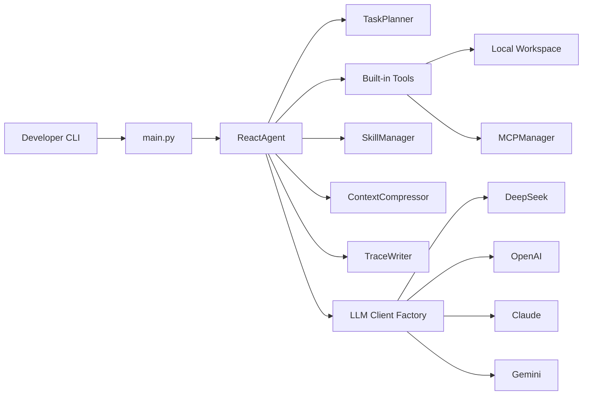

# DM-Code-Agent

<div align="center">

**本地优先、可审计、可复现的 Python Code Agent**

[](https://github.com/hwfengcs/DM-Code-Agent/actions/workflows/ci.yml)
[](https://www.python.org/downloads/)
[](LICENSE)
[](MCP_GUIDE.md)
[](docs/tracing.md)

**中文** | [English](README_EN.md)

</div>

DM-Code-Agent 是一个面向真实代码维护任务的轻量 Code Agent。它在本地工作区中运行，能够调用文件、搜索、测试、lint、代码分析和 MCP 工具，并把每一步计划、工具调用、观测结果和最终报告记录为可审计 trace。

它的目标不是做一个黑盒聊天机器人，而是做一个开发者可以检查、复现、评测和扩展的代码维护助手。

## 适合做什么

- 修复小到中等规模的 bug，并运行测试验证。
- 补充回归测试，避免只修 visible case。
- 分析项目结构、函数签名、依赖和代码指标。
- 执行小型重构或文档一致性修复。
- 生成 trace 和 benchmark 报告，用于审计 agent 的行为质量。

## 核心能力

| 能力 | 说明 |
| --- | --- |
| ReAct Agent | 模型输出 `thought/action/action_input`，Agent 执行工具并把 observation 写回上下文 |
| Task Planner | 执行前生成 3-8 步计划，失败后可触发 replan |
| Tool System | 文件读写、搜索、Python/Shell 执行、测试、lint、AST、代码指标 |
| Code Index | 扫描 Python 仓库，生成符号索引、符号搜索和本地依赖图 |
| Trace / Replay | JSONL trace 记录 run、plan、LLM 调用摘要、tool call、step、replan 和结果 |
| Multi-LLM | 支持 DeepSeek、OpenAI、Claude、Gemini 和自定义 `base_url` |
| MCP Integration | 通过配置接入 Playwright、Context7、Filesystem、SQLite 等 MCP server |
| Skill System | 根据任务激活 Python、数据库、前端等领域技能和专用工具 |
| Evals | 无 API key 的确定性 eval，覆盖 JSON 修复、工具恢复、replan 等行为 |
| Maintenance Benchmarks | 更贴近日常维护任务的 hidden-test benchmark，记录改动文件约束和 agent 指标 |

## 快速开始

```bash
git clone https://github.com/hwfengcs/DM-Code-Agent.git
cd DM-Code-Agent

python -m venv .venv
.\.venv\Scripts\Activate.ps1
pip install -e ".[dev]"

copy .env.example .env
dm-agent --help
```

Linux/macOS:

```bash
python -m venv .venv
source .venv/bin/activate
pip install -e ".[dev]"
cp .env.example .env
dm-agent --help
```

在 `.env` 中填入至少一个模型 API key 后运行：

```bash
dm-agent "分析当前项目结构，列出最适合优先测试的模块" --provider deepseek --show-steps
```

## Trace 与 Replay

默认 trace 不保存完整 prompt 和 raw response，只记录可审计摘要、工具输入输出和执行结果：

```bash
dm-agent "修复 retry.py 的重试边界，并运行测试" \
  --provider deepseek \
  --trace traces/retry-fix.jsonl \
  --report reports/retry-fix.md

dm-agent-trace view traces/retry-fix.jsonl
dm-agent-trace replay traces/retry-fix.jsonl
```

如果需要私有调试，可以显式记录完整 LLM I/O：

```bash
dm-agent "解释这个模块" --trace traces/debug.jsonl --trace-llm-io
```

`--trace-llm-io` 可能包含源码、路径、命令输出或模型上下文，只建议在本地私有环境使用。详见 [docs/tracing.md](docs/tracing.md)。

## Benchmark

查看 coding benchmark：

```bash
dm-agent-bench --list
```

查看更真实的 maintenance benchmark：

```bash
dm-agent-bench --suite maintenance --list
```

运行一次真实模型维护任务：

```bash
dm-agent-bench --suite maintenance \
  --provider deepseek \
  --task config_precedence \
  --output bench_reports/maintenance.json \
  --markdown bench_reports/maintenance.md \
  --trace-dir bench_reports/traces
```

报告会包含 hidden-test pass rate、agent completion rate、平均步骤、工具调用、token 估算、改动文件列表和文件约束违规情况。详见 [docs/benchmarks.md](docs/benchmarks.md)。

## 架构




## 项目结构

```text
DM-Code-Agent/
├── main.py
├── dm_agent/
│   ├── core/          # ReactAgent and TaskPlanner
│   ├── tools/         # file, execution, test, lint, AST tools
│   ├── tracing/       # JSONL trace writer and trace CLI
│   ├── benchmarks/    # coding and maintenance benchmark suites
│   ├── evals/         # deterministic and real-model eval runners
│   ├── mcp/           # MCP config/client/manager
│   ├── skills/        # built-in and custom skill system
│   └── memory/        # context compression
├── tests/
├── docs/
├── benchmarks/
├── evals/
└── pyproject.toml
```

## 本地验证

```bash
python -m compileall dm_agent main.py tests
python -m pytest
python -m dm_agent.evals.cli --variant full --task direct_finish
python -m dm_agent.benchmarks.cli --suite maintenance --list
python -m ruff check .
python -m black --check .
```

当前测试、确定性 eval 和 benchmark manifest 检查都不依赖真实 API key。

## 文档

- [docs/product.md](docs/product.md)：产品定位和落地场景
- [docs/tracing.md](docs/tracing.md)：trace schema、view、replay 和隐私边界
- [docs/benchmarks.md](docs/benchmarks.md)：benchmark suite、评分和报告字段
- [MCP_GUIDE.md](MCP_GUIDE.md)：MCP 配置
- [SKILL_GUIDE.md](SKILL_GUIDE.md)：内置和自定义 skill

## Roadmap

- Trace diff：比较两次 agent run 的计划、工具调用和最终结果。
- Tool replay sandbox：为危险工具提供更明确的隔离执行策略。
- Maintenance benchmark 扩展：加入文档一致性、CI 配置修复、跨文件重构和多轮修复任务。
- Code index：符号索引、依赖图和跨文件代码理解工具。
- Run report：自动生成改动摘要、验证命令和剩余风险。

## 贡献

欢迎提交 Issue 和 PR。建议先阅读 [CONTRIBUTING.md](CONTRIBUTING.md)、[SECURITY.md](SECURITY.md) 和 [AGENTS.md](AGENTS.md)。

## License

MIT License. See [LICENSE](LICENSE).
