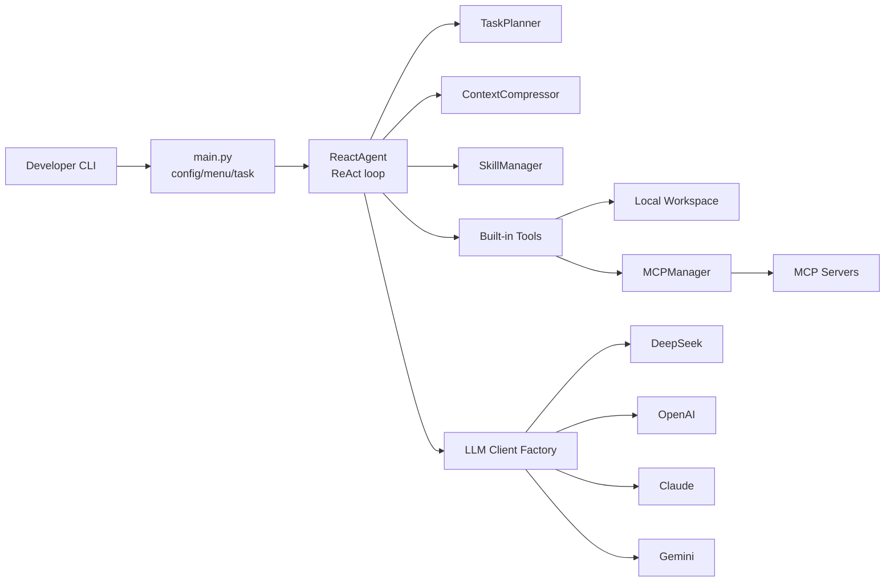

# DM-Code-Agent

<div align="center">

**轻量、可扩展、可测试的 Python Code Agent 框架**

[](https://github.com/hwfengcs/DM-Code-Agent/actions/workflows/ci.yml)
[](https://www.python.org/downloads/)
[](LICENSE)
[](MCP_GUIDE.md)
[](#核心能力)

**中文** | [English](README_EN.md)

</div>

DM-Code-Agent 是一个面向学习、实验和二次开发的 Code Agent 项目。它用清晰的 Python 代码实现了 ReAct 循环，并把多模型 LLM、任务规划、工具调用、MCP 扩展、专家 Skill、上下文压缩和 CLI 体验组合在一起。

如果你想快速理解“一个代码智能体到底怎么工作”，或者想基于一个小而完整的框架继续做 Agent 评测、规划、工具使用和工程化实验，这个项目会比大型框架更容易读懂和改造。

## 为什么值得关注

- **小而完整**：约数千行 Python，覆盖 Agent loop、Planner、Tool、Memory、Skill、MCP 和 CLI。
- **多模型可切换**：支持 DeepSeek、OpenAI、Claude、Gemini，并保留自定义 `base_url`。
- **MCP ready**：通过配置接入 Playwright、Context7、Filesystem、SQLite 等 MCP Server。
- **Skill 专家系统**：根据任务自动激活 Python、数据库、前端等领域能力，并注入专用工具与 prompt。
- **工程化补强**：提供 `pyproject.toml`、可安装 CLI、pytest 测试、ruff/black 配置和 GitHub Actions CI。
- **适合做 Agent 算法展示**：后续可自然扩展到 evals、ablation、tool-use success rate、replan recovery 等方向。

## 30 秒快速开始

```bash
git clone https://github.com/hwfengcs/DM-Code-Agent.git
cd DM-Code-Agent

python -m venv .venv
.\.venv\Scripts\Activate.ps1
pip install -e ".[dev]"

copy .env.example .env
dm-agent --help
```

Linux/macOS:

```bash
python -m venv .venv
source .venv/bin/activate
pip install -e ".[dev]"
cp .env.example .env
dm-agent --help
```

在 `.env` 中填入至少一个模型 API Key 后即可运行：

```bash
dm-agent "分析当前项目结构，并列出最重要的模块" --provider deepseek --show-steps
```

也可以继续使用源码入口：

```bash
python main.py "创建一个带测试的 Python 计算器"
```

## 核心能力

| 能力 | 说明 |
| --- | --- |
| ReAct Agent | 模型以 JSON 形式输出 `thought/action/action_input`，Agent 执行工具并回写 observation |
| Task Planner | 执行前生成 3-8 步计划，并跟踪计划完成状态 |
| Tool System | 文件读写、代码搜索、Python/Shell 执行、测试、lint、AST 分析、代码指标 |
| Multi-LLM | DeepSeek、OpenAI、Claude、Gemini 统一客户端工厂 |
| MCP Integration | MCP Server 生命周期管理，自动包装外部工具为本地 Tool |
| Skill System | 按关键词和代码模式激活领域专家能力，支持 JSON 自定义技能 |
| Memory Compression | 多轮对话中自动压缩历史，降低长任务 token 压力 |
| Agent Evals | 内置确定性评测任务、消融变体、恢复指标和报告导出 |
| Coding Benchmarks | 基于隐藏测试的代码能力评测，覆盖 bugfix、边界条件和状态逻辑 |
| CLI Experience | 支持单任务命令、交互式菜单、多轮对话和运行时配置 |

## 架构图

可编辑源文件在 [docs/architecture.drawio](docs/architecture.drawio)，导出图在 [docs/architecture.drawio.png](docs/architecture.drawio.png)。




## 项目结构

```text
DM-Code-Agent/
├── main.py                     # CLI entry point
├── dm_agent/
│   ├── core/                   # ReactAgent and TaskPlanner
│   ├── clients/                # DeepSeek, OpenAI, Claude, Gemini adapters
│   ├── tools/                  # File, execution, test, lint, AST tools
│   ├── mcp/                    # MCP config/client/manager
│   ├── skills/                 # Built-in and custom skill system
│   ├── evals/                  # Deterministic eval runner and ablations
│   ├── memory/                 # Context compression
│   └── prompts/                # System prompt builder
├── evals/                      # Eval docs, task manifest, runner wrapper
├── tests/                      # Unit tests with fake LLM clients
├── docs/                       # Architecture diagram assets
├── pyproject.toml              # Package metadata, CLI, dev tooling
└── .github/workflows/ci.yml    # Cross-platform CI
```

## 使用示例

### 单任务模式

```bash
dm-agent "统计 dm_agent 目录下所有 Python 文件的函数和类数量" --show-steps
```

### 多模型切换

```bash
dm-agent "为 calculator.py 编写 pytest 测试" --provider openai --model gpt-5
dm-agent "检查这个项目的 README 是否清晰" --provider claude --model claude-sonnet-4-5
dm-agent "分析 main.py 的依赖关系" --provider gemini --model gemini-2.5-flash
```

### MCP 工具

复制并修改配置：

```bash
copy mcp_config.json.example mcp_config.json
dm-agent "打开 https://example.com 并截图"
```

更多说明见 [MCP_GUIDE.md](MCP_GUIDE.md)。

### 自定义 Skill

在 `dm_agent/skills/custom/` 下创建 JSON：

```json
{
  "name": "devops_expert",
  "display_name": "DevOps Expert",
  "description": "Docker, Kubernetes and CI/CD guidance",
  "keywords": ["docker", "kubernetes", "ci", "deploy"],
  "prompt_addition": "Prefer reproducible deployment steps and explicit verification."
}
```

更多说明见 [SKILL_GUIDE.md](SKILL_GUIDE.md)。

## Agent Evals 与消融实验

第三阶段新增了一个无 API Key 的确定性评测系统，用 fake LLM client 固定模型输出，专门验证 Agent loop、工具调用、恢复能力和工程指标。

```bash
# 查看内置任务和消融变体
dm-agent-eval --list

# 跑完整 12 个任务 x 4 个变体的消融评测
dm-agent-eval --output eval_reports/ablation.json --markdown eval_reports/ablation.md

# 只跑恢复能力相关任务
dm-agent-eval --task json_repair --task tool_failure_replan --variant full

# 跑真实模型评测（会消耗 API quota）
dm-agent-eval --real --provider deepseek --variant full --task real_read_file
dm-agent-eval --real --provider deepseek --output eval_reports/real_deepseek.json --markdown eval_reports/real_deepseek.md
```

当前内置任务覆盖：

- 文件创建、文件读取、代码搜索、Python 执行。
- AST 代码指标与函数签名提取。
- Skill 激活信号。
- JSON 解析漂移修复。
- 未知工具恢复、工具失败后 replan、无效参数恢复。

评测报告会输出 success rate、平均步数、平均工具调用数、prompt/completion 字符数、token 估算、可选 cost 估算、recovery events 和 skill activation runs。实现见 [dm_agent/evals](dm_agent/evals)，任务说明见 [evals/README.md](evals/README.md)。
真实模型评测复用同一套指标，并额外记录 provider、model、request count 和 API 返回的 token usage，适合展示真实 Agent 行为和消融实验。

## Coding Benchmarks

L2 能力评测使用独立命令 `dm-agent-bench`。它会为每个任务创建临时 workspace，提供源码和 visible tests，让 Agent 自主阅读、修改和运行测试；Agent 结束后再注入 hidden tests，用真实 pytest 结果判分。

```bash
# 查看隐藏测试型代码任务
dm-agent-bench --list

# 跑一个真实模型任务
dm-agent-bench --provider deepseek --task slugify_cleanup

# 跑默认 L2 benchmark 并导出报告
dm-agent-bench --provider deepseek --output bench_reports/deepseek_coding.json --markdown bench_reports/deepseek_coding.md

# 跑 planning / skills / compression 消融
dm-agent-bench --provider deepseek --all-variants
```

当前内置任务覆盖 string bugfix、订单金额边界、TTL+LRU cache、用户数据清洗、统计摘要和库存预留状态逻辑。报告输出 hidden-test pass rate、平均步骤数、平均工具调用数、真实请求数和 token usage。说明见 [benchmarks/README.md](benchmarks/README.md)。

## 本地验证

```bash
python -m compileall dm_agent main.py tests
python -m pytest
python -m dm_agent.evals.cli --variant full --task direct_finish
python -m dm_agent.benchmarks.cli --list
python -m ruff check .
python -m black --check .
```

当前测试和 eval smoke test 都不依赖真实 API Key，核心 Agent 行为通过 fake/scripted LLM client 覆盖。

## 配置

`.env.example`:

```env
DEEPSEEK_API_KEY=your_deepseek_api_key_here
OPENAI_API_KEY=your_openai_api_key_here
CLAUDE_API_KEY=your_claude_api_key_here
GEMINI_API_KEY=your_gemini_api_key_here
```

`config.json.example`:

```json
{
  "provider": "deepseek",
  "model": "deepseek-chat",
  "base_url": "https://api.deepseek.com",
  "max_steps": 100,
  "temperature": 0.7,
  "show_steps": false
}
```

## 路线图

- Trace：导出每一步 LLM 输入、工具调用、observation 和最终报告。
- Coding benchmark：继续扩展多次采样置信区间、更多复杂代码修改任务和跨模型对比。
- Code index：符号索引、依赖图、跨文件代码理解。

## 贡献

欢迎提交 Issue 和 PR。建议先阅读 [CONTRIBUTING.md](CONTRIBUTING.md) 和 [SECURITY.md](SECURITY.md)。

## License

MIT License. See [LICENSE](LICENSE).
