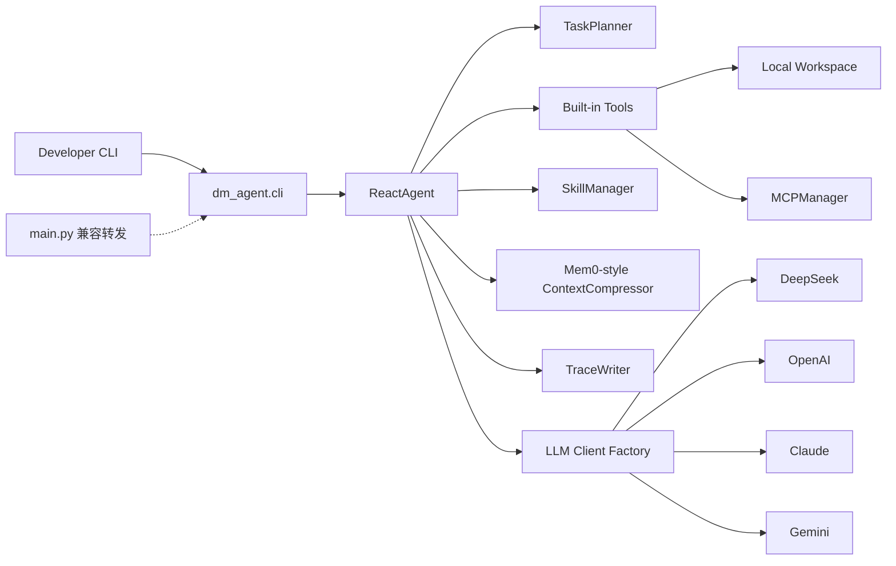

# DM-Code-Agent

<div align="center">

**本地优先、可审计、有算法骨架的 Python Code Agent**

[](https://github.com/hwfengcs/DM-Code-Agent/actions/workflows/ci.yml)
[](https://www.python.org/downloads/)
[](LICENSE)
[](MCP_GUIDE.md)
[](docs/tracing.md)
[](docs/research-log/01-swebench-baseline.md)
[](docs/research-log/)

**中文** | [English](README_EN.md) | [Français](README_FR.md)

</div>

> **一句话**：DM-Code-Agent 是一个把 ReAct + Planner + Replan + Trace 写在 ~1500 行可读 Python 里的代码维护 Agent；v2 已落地默认关闭的 Reflexion / Critic / Self-Consistency / Adaptive Replan 模块，并接入 SWE-bench Lite Tier-1 评测链路。
>
> 它不是要做又一个聊天黑盒，而是要做一个开发者能看懂、能复现、能扩展、能拿来对比研究的 Code Agent baseline。

## Why this project

- **可审计 (Auditable)**：每一步的计划、工具调用、观察结果都写入 JSONL trace，trace 自带 dry replay、显式 tool replay 和离线 diff，调试不靠"再问一次模型"。
- **可对标 (Benchmarked)**：项目自带 coding 与 maintenance 两套 hidden-test benchmark，并已发布 SWE-bench Lite DeepSeek Tier-1 baseline：0.0% resolved / 72.0% patch-applied on the fixed 50-instance subset。这个 Tier-1 数字受 host verifier 环境噪声影响，不能和官方 leaderboard 直接比较；真实 ablation 仍在冻结，现有离线报告都附 raw JSON。
- **有算法 (Algorithmic, v2)**：不是"调用 GPT-4 并写个 ReAct"。Reflexion、Critic、Self-Consistency、Adaptive Replanning 都是默认关闭的模块化能力，并有 keyless 测试与 research log。真实 SWE-bench ablation 等允许的 live run 后再补。
- **可扩展 (Extensible)**：内置 Skill 系统 + MCP 集成，任务激活领域 prompt 与专用工具；4 家主流 LLM 适配（DeepSeek/OpenAI/Claude/Gemini），可加自定义 `base_url`。

## v.s. 同类项目（当前公开口径）

| 维度 | DM-Code-Agent | Aider | OpenHands | SWE-agent | smolagents |
| --- | --- | --- | --- | --- | --- |
| 本地优先（无沙箱依赖） | ✅ | ✅ | docker | docker | ✅ |
| Trace + Replay | ✅ JSONL + dry/tool replay + diff | git diff | server log | trajectory | 弱 |
| Reflexion / Critic / Self-Consistency | ✅ v2 | ❌ | partial | ❌ | ❌ |
| Mem0 风格上下文记忆 | ✅ 本地原子记忆 | repo-map | partial | trajectory | weak |
| MCP 集成 | ✅ | ❌ | ✅ | ❌ | ❌ |
| 自带 maintenance benchmark | ✅ 6+ tasks | ❌ | ❌ | SWE-bench | ❌ |
| 公开 SWE-bench Lite 分数 | ⚠️ Tier-1：0.0%（50/300 子集，非官方口径） | ❌ | ✅ | ✅ | ❌ |
| 代码体积（核心 LOC） | ~1500 | ~10k | ~50k | ~5k | ~3k |
| License | MIT | Apache-2.0 | MIT | MIT | Apache-2.0 |

> 表中的 SWE-bench Tier-1 baseline 已在 P1 落地；leaderboard-comparable 分数需要 Tier-2 Docker verifier。当前冻结真实 SWE-bench / Docker / cross-model 跑分，因此 v2 算法模块只声明代码、测试和离线报告能力，不声明真实分数提升。
> 进度见 [docs/research-log/](docs/research-log/) 与 [CHANGELOG.md](CHANGELOG.md)。

## Algorithm Highlights（v2 status）

| 模块 | 状态 | 说明 | Devlog |
| --- | --- | --- | --- |
| ReAct + Planner + Replan | ✅ v1.5 | 基础 ReAct 循环 + 3-8 步全局计划 + 失败 replan | [00](docs/research-log/00-kickoff.md) |
| SWE-bench Lite suite | ✅ P1 | 50 题子集，DeepSeek Tier-1 baseline：0.0% resolved / 72.0% patch-applied；含失败模式分析并已说明 host verifier 噪声 | [01](docs/research-log/01-swebench-baseline.md) |
| Reflexion (episodic memory) | ✅ P2 impl | 失败 trial 反思 → lesson → 注入下一次 prompt；ablation 待 Tier-1 子集清理后发布 | [02](docs/research-log/02-reflexion.md) |
| Mem0 风格上下文记忆 | ✅ current | 把旧上下文提取为 episodic / semantic / procedural 原子记忆，按当前任务召回，并保留最近轮次原文 | - |
| Critic + Self-Consistency | ✅ P4 impl | 完成前加 peer-review 门卫 + N 路独立试跑选优（majority vote / critic score / test pass），并记录候选分歧与置信度 | [04](docs/research-log/04-critic-and-consistency.md) |
| Adaptive Replanning + Token economics | ✅ P5 impl | 默认关闭；错误信号映射到 replan 策略，离线统计 token / cost-per-success；真实跨模型跑分冻结 | [05](docs/research-log/05-adaptive-and-economics.md) |
| Final write-up + release checklist | ✅ P6 docs | 发布叙事、社区分发清单和面试 bullet；不包含未运行的真实评测声明 | [06](docs/research-log/06-final-writeup.md) |
| 长上下文护栏（截断/token 预算/edit guard） | ✅ post-v2 | 默认开：观察截断+分页提示、预算触发压缩、read-before-edit 拦截；记忆卫生与 LLM 摘要默认关 | [23](docs/research-log/23-observation-truncation-and-token-budget.md) [24](docs/research-log/24-memory-hygiene-and-recall.md) |
| 状态容错（统一重试/原子写/checkpoint/熔断） | ✅ post-v2 | 四家 provider 统一瞬时故障重试、原子写+备份、run 级 checkpoint/resume、进度保留 replan；熔断默认关 | [25](docs/research-log/25-unified-llm-retry-and-atomic-io.md) [26](docs/research-log/26-run-checkpoint-and-progress-carrying-replan.md) [27](docs/research-log/27-tool-circuit-breaker-experiment.md) |
| Evals 闭环（恢复率/能力画像/CI 门禁） | ✅ post-v2 | 恢复成功率、per-tag 聚合、幻觉代理指标、repeat 方差、per-test 部分得分；CI 全量 keyless eval 100% 门禁 + manifest 守卫 | [28](docs/research-log/28-evals-recovery-capability-and-gates.md) |

## Research Log

DM-Code-Agent 的每个非平凡设计决策都会留下 devlog：动机、实验、ablation、踩坑、下一步。
入口：[`docs/research-log/`](docs/research-log/)。已发布：

- [00 — Kickoff: Why a v2 algorithm-track upgrade?](docs/research-log/00-kickoff.md)
- [01 — SWE-bench Lite baseline: harness, sampling, and the road to numbers](docs/research-log/01-swebench-baseline.md)
- [02 — Reflexion: episodic memory across trials](docs/research-log/02-reflexion.md)
- [04 — Critic and self-consistency: peer review before acceptance](docs/research-log/04-critic-and-consistency.md)
- [05 — Adaptive replanning and token economics](docs/research-log/05-adaptive-and-economics.md)
- [06 — Final write-up: v2 algorithm stack](docs/research-log/06-final-writeup.md)
- [Distribution checklist](docs/research-log/DISTRIBUTION_CHECKLIST.md)
- [Interview talking points](docs/research-log/INTERVIEW_TALKING_POINTS.md)

---

DM-Code-Agent 是一个面向真实代码维护任务的轻量 Code Agent。它在本地工作区中运行，能够调用文件、搜索、测试、lint、代码分析和 MCP 工具，并把每一步计划、工具调用、观测结果和最终报告记录为可审计 trace。

它的目标不是做一个黑盒聊天机器人，而是做一个开发者可以检查、复现、评测和扩展的代码维护助手。

## 适合做什么

- 修复小到中等规模的 bug，并运行测试验证。
- 补充回归测试，避免只修 visible case。
- 分析项目结构、函数签名、依赖和代码指标。
- 执行小型重构或文档一致性修复。
- 生成 trace 和 benchmark 报告，用于审计 agent 的行为质量。

## 核心能力

| 能力 | 说明 |
| --- | --- |
| ReAct Agent | 模型输出 `thought/action/action_input`，Agent 执行工具并把 observation 写回上下文 |
| Context Guards | 默认开：超长观察截断并附分页提示、估算 token 预算触发提前压缩、edit_file 先读后改守卫 |
| Fault Tolerance | 统一 LLM 瞬时故障重试、原子文件写入+修改前备份、MCP 超时可配+单次重连、`--checkpoint/--resume` 断点续跑 |
| Task Planner | 执行前生成 3-8 步计划，失败后可触发 replan；重规划保留已完成进度并有预算护栏 |
| Adaptive Replanning | 默认关闭；把 tool/parse/test/critic/max-steps 错误映射到恢复策略，并记录重复失败信号 |
| Reflexion | 默认关闭；失败 trial 可生成 lesson 并注入下一轮 prompt |
| Context Memory | Mem0 风格本地 add/search 记忆压缩，按 scope 保存原子记忆并保留最近轮次 |
| Tool System | 文件读写、搜索、Python/Shell 执行、测试、lint、AST、代码指标 |
| Code Index | 扫描 Python 仓库，生成符号索引、符号搜索和本地依赖图 |
| Trace / Replay | JSONL trace 记录 run、plan、LLM 调用摘要、tool call、step、replan 和结果；支持离线 trace diff |
| Multi-LLM | 支持 DeepSeek、OpenAI、Claude、Gemini 和自定义 `base_url` |
| MCP Integration | 通过配置接入 Playwright、Context7、Filesystem、SQLite 等 MCP server |
| Skill System | 根据任务激活 Python、数据库、前端等领域技能和专用工具 |
| Evals | 无 API key 的确定性 eval，覆盖 JSON 修复、工具恢复、replan 等行为 |
| Maintenance Benchmarks | 更贴近日常维护任务的 hidden-test benchmark，记录改动文件约束和 agent 指标 |

## 快速开始

```bash
git clone https://github.com/hwfengcs/DM-Code-Agent.git
cd DM-Code-Agent

python -m venv .venv
.\.venv\Scripts\Activate.ps1
pip install -e ".[dev]"

copy .env.example .env
dm-agent --help
```

Linux/macOS:

```bash
python -m venv .venv
source .venv/bin/activate
pip install -e ".[dev]"
cp .env.example .env
dm-agent --help
```

在 `.env` 中填入至少一个模型 API key 后运行：

```bash
dm-agent "分析当前项目结构，列出最适合优先测试的模块" --provider deepseek --show-steps
```

## Trace 与 Replay

默认 trace 不保存完整 prompt 和 raw response，只记录可审计摘要、工具输入输出和执行结果：

```bash
dm-agent "修复 retry.py 的重试边界，并运行测试" \
  --provider deepseek \
  --trace traces/retry-fix.jsonl \
  --report reports/retry-fix.md

dm-agent-trace view traces/retry-fix.jsonl
dm-agent-trace analyze traces/retry-fix.jsonl
dm-agent-trace analyze-dir bench_reports/traces
dm-agent-trace replay traces/retry-fix.jsonl
```

`analyze` 会离线标记首个失败阶段、恢复链路、验证缺口和 trace health，不调用模型也不执行工具。

比较两次 run 的计划、工具调用和最终结果，不调用模型也不执行工具：

```bash
dm-agent-trace diff traces/baseline.jsonl traces/critic-enabled.jsonl
```

如果需要私有调试，可以显式记录完整 LLM I/O：

```bash
dm-agent "解释这个模块" --trace traces/debug.jsonl --trace-llm-io
```

`--trace-llm-io` 可能包含源码、路径、命令输出或模型上下文，只建议在本地私有环境使用。详见 [docs/tracing.md](docs/tracing.md)。

## Benchmark

查看 coding benchmark：

```bash
dm-agent-bench --list
```

查看更真实的 maintenance benchmark：

```bash
dm-agent-bench --suite maintenance --list
```

运行一次真实模型维护任务：

```bash
dm-agent-bench --suite maintenance \
  --provider deepseek \
  --task config_precedence \
  --output bench_reports/maintenance.json \
  --markdown bench_reports/maintenance.md \
  --trace-dir bench_reports/traces
```

报告会包含 hidden-test pass rate、95% 置信区间、agent completion rate、平均步骤、工具调用、token 估算、改动文件列表、文件约束违规、任务 manifest 指纹；启用 `--trace-dir` 时还会附带离线 trace analysis。详见 [docs/benchmarks.md](docs/benchmarks.md)。

离线生成 token 经济学报告（不调用模型、不联网）：

```bash
dm-agent-economics bench_reports/swebench_lite_baseline.json \
  --label swebench-tier1-baseline \
  --cost-per-1k-tokens 0.00027 \
  --output-json bench_reports/economics.json \
  --output-md bench_reports/economics.md
```

`--cost-per-1k-tokens` 是显式输入的本地会计参数，不是实时价格查询。

默认关闭的算法模块也可以接入 coding / maintenance benchmark plumbing，用于本地 smoke 或后续真实实验：

```bash
dm-agent-bench --suite maintenance \
  --enable-critic \
  --self-consistency-runs 3 \
  --self-consistency-strategy test_pass
```

这些开关只在真实 benchmark run 时触发额外模型调用；CI 只验证 keyless 参数解析和 fake-result plumbing。SWE-bench Lite 的 self-consistency 在真实评测冻结期会明确拒绝运行，避免误报新分数。

## Context Memory

长对话会使用本地 Mem0 风格策略压缩：旧消息被提取成 episodic / semantic / procedural 原子记忆，按当前任务检索为 `<agent_memory>`，同时保留最近轮次原文。

## 架构



```mermaid
flowchart LR
    User[Developer CLI] --> CLI[dm_agent.cli]
    Compat[main.py 兼容转发] -.-> CLI
    CLI --> Agent[ReactAgent]
    Agent --> Planner[TaskPlanner]
    Agent --> Tools[Built-in Tools]
    Agent --> Skills[SkillManager]
    Agent --> Memory[Mem0-style ContextCompressor]
    Agent --> Trace[TraceWriter]
    Tools --> Workspace[Local Workspace]
    Tools --> MCP[MCPManager]
    Agent --> LLM[LLM Client Factory]
    LLM --> DeepSeek
    LLM --> OpenAI
    LLM --> Claude
    LLM --> Gemini
```

安装后的 `dm-agent` 入口指向 `dm_agent.cli:main`；根目录 `main.py` 仅保留
`python main.py` 的兼容转发，不会作为顶级 `main` 模块安装。

## 项目结构

```text
DM-Code-Agent/
├── main.py             # 兼容 python main.py 的薄转发
├── dm_agent/
│   ├── cli/           # CLI 入口、参数、配置、UI、报告与运行装配
│   ├── core/          # ReactAgent and TaskPlanner
│   ├── tools/         # file, execution, test, lint, AST tools
│   ├── tracing/       # JSONL trace writer and trace CLI
│   ├── benchmarks/    # coding and maintenance benchmark suites
│   ├── evals/         # deterministic and real-model eval runners
│   ├── mcp/           # MCP config/client/manager
│   ├── skills/        # built-in and custom skill system
│   └── memory/        # context compression
├── tests/
├── docs/
├── benchmarks/
├── evals/
└── pyproject.toml
```

## 本地验证

```bash
python -m compileall dm_agent main.py tests
python -m pytest
python -m dm_agent.evals.cli --variant full --task direct_finish
python -m dm_agent.benchmarks.cli --suite maintenance --list
python -m ruff check .
python -m black --check .
```

当前测试、确定性 eval 和 benchmark manifest 检查都不依赖真实 API key。

## 文档

- [docs/research-log/](docs/research-log/)：v2 算法升级的设计动机、实验、ablation 与踩坑记录
- [docs/release-v2.0.0.md](docs/release-v2.0.0.md)：v2 发布说明和 smoke checklist
- [docs/product.md](docs/product.md)：产品定位和落地场景
- [docs/tracing.md](docs/tracing.md)：trace schema、view、replay 和隐私边界
- [docs/benchmarks.md](docs/benchmarks.md)：benchmark suite、评分和报告字段
- [docs/extensions.md](docs/extensions.md)：扩展 API、发现优先级、项目目录信任与安全警告
- [MCP_GUIDE.md](MCP_GUIDE.md)：MCP 配置
- [SKILL_GUIDE.md](SKILL_GUIDE.md)：内置和自定义 skill
- [CHANGELOG.md](CHANGELOG.md)：版本变更

## 版本演进

每个大版本"加了什么、删了什么、为什么",完整条目见 [CHANGELOG.md](CHANGELOG.md)。

| 版本 | 主题 | 新增(代表性) | 移除 / 替换 |
| --- | --- | --- | --- |
| v1.5.0 | 初始公开版 | ReAct 循环 + Planner/Replan + 上下文压缩;DeepSeek/OpenAI/Claude/Gemini 四家适配;MCP、Skill 系统;JSONL trace + replay;coding/maintenance hidden-test benchmark;keyless 确定性 eval;Ubuntu+Windows CI | — |
| v1.6.0 | 治理与 v2 启动 | CHANGELOG、行为准则、issue/PR 模板;`docs/research-log/` devlog 体系;README 重写(对标表、Algorithm Highlights) | 清理 `agent.py`/`planner.py` 内的 thinking TODO 注释 |
| v1.7.0 | SWE-bench Lite 接入 | `swebench_lite` 适配层:固定 50 题子集(seed=42)、per-instance git 工作区、Tier-1 host verifier、9 类失败模式分析器 | — |
| v1.7.1 | Tier-1 基线发布 | 首个公开基线:0.0% resolved / 72.0% patch-applied(非官方口径,含 host 噪声审计);instance 级 resume/checkpoint;DeepSeek 瞬时故障重试;Windows 输出解码修复 | — |
| v2.0.0 | 算法栈落地 | Reflexion(episodic memory)、Critic 完成门、Self-Consistency 多路选优、Adaptive Replanning、离线 token economics——全部默认关闭、keyless 可测;P6 发布材料 | 冻结真实 SWE-bench / Docker / 跨模型跑分声明(未运行的分数一律不写) |
| v2.0 之后(可观测性批次) | Trace 与评测溯源 | `dm-agent-trace analyze / analyze-dir / diff`;benchmark Wilson 95% 置信区间;manifest 指纹溯源 + `dm-agent-manifest-diff`;self-consistency 不确定性元数据与 patch 指纹投票;economics 置信区间(devlog 07–22) | **删除整条 RAG / 仓库索引检索链路**(CLI 入口、context 导出、opt-in flags、可选依赖 extra),替换为 Mem0 风格本地原子记忆——本地优先、零新增运行时依赖 |
| v2.0 之后(2026-07 三问题升级) | 长上下文 / 容错 / Evals 闭环 | 默认开护栏:观察截断+分页提示、token 预算触发压缩、read-before-edit 守卫、统一 LLM 重试、原子写+备份;`--checkpoint/--resume` 断点续跑、进度保留 replan;默认关模块:memory hygiene、LLM 摘要、熔断器;Evals 侧:恢复成功率、per-tag 能力画像、幻觉代理指标、repeat 方差、CI 100% eval 门禁 + manifest 守卫(devlog 23–28) | 修正 swebench 失败分类(max-steps 不再误标 regression);trace schema 1.0→1.1 纯增量,无破坏性删除 |

## Roadmap

v2 本地算法栈已经按 [`docs/research-log/00-kickoff.md`](docs/research-log/00-kickoff.md) 的路线图交付到 P6：
SWE-bench Lite Tier-1 baseline → Reflexion → Critic + Self-Consistency → Adaptive Replanning + 离线 token economics → README/write-up 发布素材。

冻结项：Docker/Tier-2 SWE-bench、真实 cross-model 跑分、以及任何 v2 机制的真实分数提升声明，都会等允许的真实评测后再补。

短期持续在做的非算法方向：

- Trace completeness：把 trace analyzer 接入 benchmark report，标记缺失 trace、验证缺口和 replay 风险。
- Tool replay sandbox：为危险工具提供更明确的隔离执行策略。
- Maintenance benchmark 扩展：加入文档一致性、CI 配置修复、跨文件重构和多轮修复任务。
- Run report：自动生成改动摘要、验证命令和剩余风险。

发布记录见 [CHANGELOG.md](CHANGELOG.md)。

## 贡献

欢迎提交 Issue 和 PR。建议先阅读 [CONTRIBUTING.md](CONTRIBUTING.md)、[SECURITY.md](SECURITY.md)、[AGENTS.md](AGENTS.md) 与 [CODE_OF_CONDUCT.md](CODE_OF_CONDUCT.md)。

如果你的工作有算法决策或非平凡 ablation，请同步在 [`docs/research-log/`](docs/research-log/) 留下一篇 devlog。

## License

MIT License. See [LICENSE](LICENSE).
