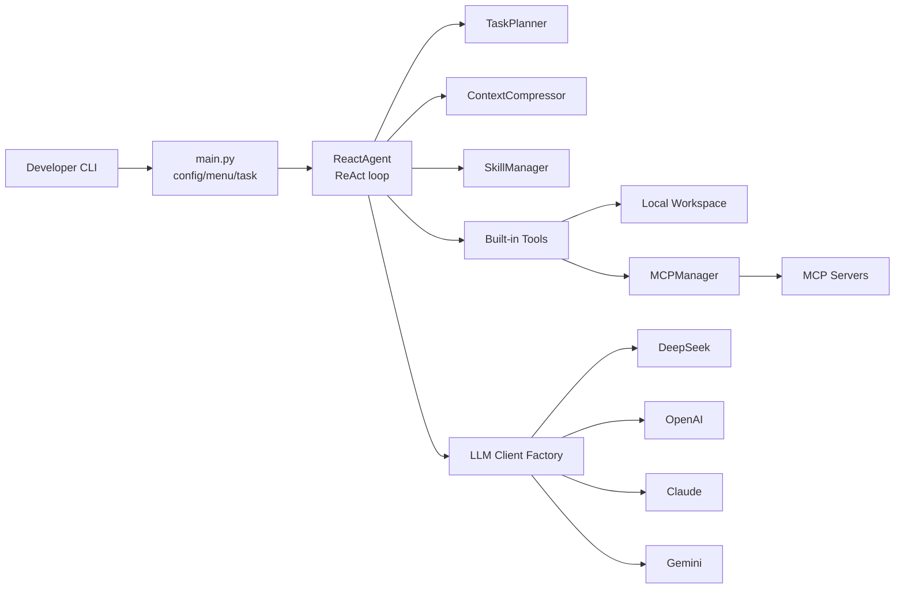

# DM-Code-Agent

<div align="center">

**A lightweight, extensible, testable Python Code Agent framework**

[](https://github.com/hwfengcs/DM-Code-Agent/actions/workflows/ci.yml)
[](https://www.python.org/downloads/)
[](LICENSE)
[](MCP_GUIDE.md)
[](#core-capabilities)

[Chinese](README.md) | **English**

</div>

DM-Code-Agent is a compact Code Agent project for learning, experimentation, and extension.
It implements a readable ReAct loop in Python and connects multi-provider LLM clients,
task planning, tool execution, MCP extensions, skills, context compression, and a practical CLI.

If you want to understand how a code agent works without digging through a large framework,
this project is intentionally small enough to read and serious enough to extend.

## Why Star It

- **Small but complete**: agent loop, planner, tools, memory, skills, MCP, and CLI.
- **Multi-provider LLM support**: DeepSeek, OpenAI, Claude, Gemini, and custom `base_url`.
- **MCP ready**: attach Playwright, Context7, filesystem, SQLite, and other MCP servers.
- **Skill system**: automatically activates domain prompts and skill-specific tools.
- **Engineering baseline**: `pyproject.toml`, installable CLI, pytest, ruff/black, and GitHub Actions CI.
- **Good agent research surface**: ready to grow into evals, ablations, tracing, and recovery experiments.

## Quick Start

```bash
git clone https://github.com/hwfengcs/DM-Code-Agent.git
cd DM-Code-Agent

python -m venv .venv
.\.venv\Scripts\Activate.ps1
pip install -e ".[dev]"

copy .env.example .env
dm-agent --help
```

Linux/macOS:

```bash
python -m venv .venv
source .venv/bin/activate
pip install -e ".[dev]"
cp .env.example .env
dm-agent --help
```

Add at least one provider API key to `.env`, then run:

```bash
dm-agent "Analyze the current project structure and list the most important modules" --provider deepseek --show-steps
```

You can also use the source entry point:

```bash
python main.py "Create a Python calculator with tests"
```

## Core Capabilities

| Capability | Description |
| --- | --- |
| ReAct Agent | The model emits JSON `thought/action/action_input`; the agent executes tools and feeds back observations |
| Task Planner | Generates and tracks a 3-8 step execution plan |
| Tool System | File IO, search, Python/Shell execution, tests, linting, AST analysis, code metrics |
| Multi-LLM | Unified clients for DeepSeek, OpenAI, Claude, and Gemini |
| MCP Integration | Starts MCP servers and wraps remote tools as local agent tools |
| Skill System | Activates domain prompts and custom tools by keywords and code patterns |
| Memory Compression | Compresses long conversation history during multi-turn tasks |
| Agent Evals | Built-in deterministic tasks, ablations, recovery metrics, and report export |
| Coding Benchmarks | Hidden-test coding tasks for bugfixes, edge cases, and stateful logic |
| CLI Experience | Single-task mode, interactive menu, multi-turn mode, and persistent config |

## Architecture

Editable source: [docs/architecture.drawio](docs/architecture.drawio). Exported image:
[docs/architecture.drawio.png](docs/architecture.drawio.png).




## Project Layout

```text
DM-Code-Agent/
├── main.py
├── dm_agent/
│   ├── core/
│   ├── clients/
│   ├── tools/
│   ├── mcp/
│   ├── skills/
│   ├── evals/
│   ├── memory/
│   └── prompts/
├── evals/
├── tests/
├── docs/
├── pyproject.toml
└── .github/workflows/ci.yml
```

## Examples

```bash
dm-agent "Count functions and classes in all Python files under dm_agent" --show-steps
dm-agent "Write pytest tests for calculator.py" --provider openai --model gpt-5
dm-agent "Analyze dependencies in main.py" --provider gemini --model gemini-2.5-flash
```

MCP:

```bash
copy mcp_config.json.example mcp_config.json
dm-agent "Open https://example.com and take a screenshot"
```

See [MCP_GUIDE.md](MCP_GUIDE.md) and [SKILL_GUIDE.md](SKILL_GUIDE.md) for details.

## Agent Evals And Ablations

The project now includes deterministic, no-API-key evals powered by a scripted fake LLM
client. They validate the agent loop, tool use, recovery behavior, and reporting metrics.

```bash
dm-agent-eval --list
dm-agent-eval --output eval_reports/ablation.json --markdown eval_reports/ablation.md
dm-agent-eval --task json_repair --task tool_failure_replan --variant full
dm-agent-eval --real --provider deepseek --variant full --task real_read_file
dm-agent-eval --real --provider deepseek --output eval_reports/real_deepseek.json --markdown eval_reports/real_deepseek.md
```

The built-in suite covers file operations, search, Python execution, AST metrics, function
signature extraction, skill activation, JSON repair, unknown-tool recovery, replan after
tool failure, and invalid-argument recovery.

Reports include success rate, average steps, average tool calls, estimated tokens, optional
cost, recovery events, and skill activation runs. See [dm_agent/evals](dm_agent/evals) and
[evals/README.md](evals/README.md).
Real-model evals reuse the same schema and add provider, model, request count, and API token
usage for live agent experiments.

## Coding Benchmarks

The L2 benchmark suite uses `dm-agent-bench`. Each task creates an isolated temporary workspace
with source files and visible tests. After the agent finishes, hidden tests are injected and
pytest decides the score.

```bash
dm-agent-bench --list
dm-agent-bench --provider deepseek --task slugify_cleanup
dm-agent-bench --provider deepseek --output bench_reports/deepseek_coding.json --markdown bench_reports/deepseek_coding.md
dm-agent-bench --provider deepseek --all-variants
```

The built-in coding tasks cover string cleanup, order-total edge cases, TTL/LRU cache behavior,
user import normalization, statistics summaries, and inventory reservation semantics. Reports
include hidden-test pass rate, average steps, tool calls, real request counts, and token usage.

## Local Checks

```bash
python -m compileall dm_agent main.py tests
python -m pytest
python -m dm_agent.evals.cli --variant full --task direct_finish
python -m dm_agent.benchmarks.cli --list
python -m ruff check .
python -m black --check .
```

The test and deterministic eval suites use fake/scripted LLM clients and do not require real API keys.

## Roadmap

- Trace export: LLM inputs, tool calls, observations, and final reports.
- Coding benchmark: add confidence intervals, harder code-edit tasks, and cross-model comparisons.
- Code index: symbol search, dependency graph, and cross-file code understanding.

## Contributing

Issues and pull requests are welcome. See [CONTRIBUTING.md](CONTRIBUTING.md) and
[SECURITY.md](SECURITY.md).

## License

MIT License. See [LICENSE](LICENSE).
