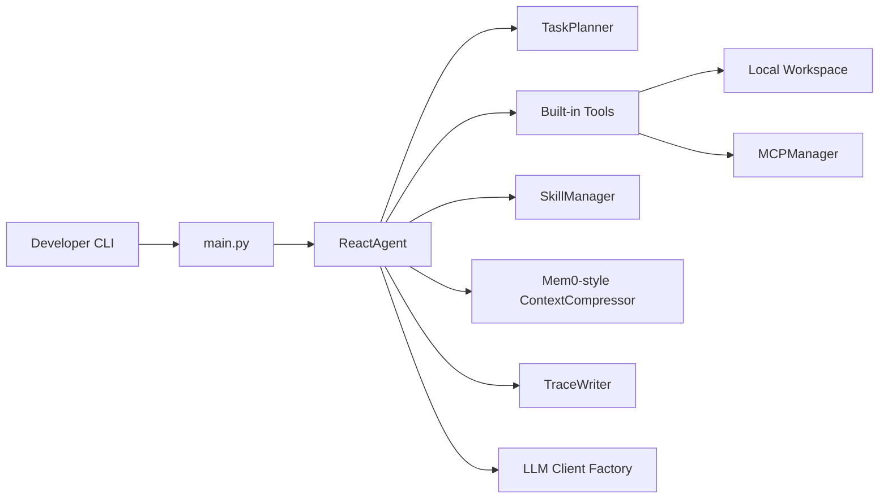

# DM-Code-Agent

<div align="center">

**A local-first, auditable Python Code Agent with an algorithmic backbone**

[](https://github.com/hwfengcs/DM-Code-Agent/actions/workflows/ci.yml)
[](https://www.python.org/downloads/)
[](LICENSE)
[](MCP_GUIDE.md)
[](docs/tracing.md)
[](docs/research-log/01-swebench-baseline.md)
[](docs/research-log/)

[Chinese](README.md) | **English** | [Français](README_FR.md)

</div>

> **One line.** DM-Code-Agent is a code-maintenance agent that fits ReAct + Planner + Replan + Trace
> into ~1500 lines of readable Python. v2 has default-off Reflexion, Critic,
> Self-Consistency, Adaptive Replanning modules, plus a SWE-bench Lite Tier-1 harness.
>
> The point is not yet another chat black box. It is a code agent that engineers can read, reproduce,
> extend, and benchmark against.

## Why this project

- **Auditable.** Every plan, tool call, and observation is written to a JSONL trace. Trace ships with
  dry replay, explicit tool replay, and offline trace diff; debugging does not require asking the
  model again.
- **Benchmarked.** Coding and maintenance hidden-test suites are in-tree. The SWE-bench Lite
  DeepSeek Tier-1 baseline is published: 0.0% resolved / 72.0% patch-applied on the fixed
  50-instance subset. This Tier-1 number is affected by host-verifier environment noise and is
  not directly comparable to the official leaderboard. Every ablation table links to its raw
  `bench_reports/*.json`.
- **Algorithmic (v2).** Not "call GPT-4 and write a ReAct loop." Reflexion, Critic,
  Self-Consistency, and Adaptive Replanning are first-class default-off modules with keyless tests
  and research logs. Real SWE-bench ablations stay frozen until a permitted live run.
- **Extensible.** Built-in skill system + MCP integration: domain prompts and specialized tools
  activate on task signals. Four LLM providers (DeepSeek/OpenAI/Claude/Gemini), plus arbitrary
  `base_url`.

## How it compares (current public basis)

| Dimension | DM-Code-Agent | Aider | OpenHands | SWE-agent | smolagents |
| --- | --- | --- | --- | --- | --- |
| Local-first (no sandbox required) | ✅ | ✅ | docker | docker | ✅ |
| Trace + Replay | ✅ JSONL + dry/tool replay + diff | git diff | server log | trajectory | weak |
| Reflexion / Critic / Self-Consistency | ✅ v2 | ❌ | partial | ❌ | ❌ |
| Context memory compression | ✅ Mem0-style local memory | repo-map | partial | trajectory | weak |
| MCP integration | ✅ | ❌ | ✅ | ❌ | ❌ |
| In-tree maintenance benchmark | ✅ 6+ tasks | ❌ | ❌ | SWE-bench | ❌ |
| Public SWE-bench Lite score | ⚠️ Tier-1: 0.0% (50/300 subset, not official) | ❌ | ✅ | ✅ | ❌ |
| Core LOC | ~1500 | ~10k | ~50k | ~5k | ~3k |
| License | MIT | Apache-2.0 | MIT | MIT | Apache-2.0 |

> The P1 SWE-bench Tier-1 baseline is published; a leaderboard-comparable score needs the Tier-2 Docker verifier. Real SWE-bench, Docker, and cross-model runs are currently frozen, so v2 modules claim code/tests/offline reports only, not real score lift. Track the progress in
> [docs/research-log/](docs/research-log/) and [CHANGELOG.md](CHANGELOG.md).

## Algorithm Highlights (v2 status)

| Module | Status | What it does | Devlog |
| --- | --- | --- | --- |
| ReAct + Planner + Replan | ✅ v1.5 | Base loop, 3-8 step plan, replan on failure | [00](docs/research-log/00-kickoff.md) |
| SWE-bench Lite suite | ✅ P1 | 50-instance DeepSeek Tier-1 baseline: 0.0% resolved / 72.0% patch-applied, with failure-mode analysis and host-verifier noise notes | [01](docs/research-log/01-swebench-baseline.md) |
| Reflexion (episodic memory) | ✅ P2 impl | Failed trial → lesson → next-trial prompt; ablation waits for a cleaner Tier-1 slice | [02](docs/research-log/02-reflexion.md) |
| Mem0-style context memory | ✅ current | Extracts atomic memories from older context, searches relevant memories, and keeps recent turns verbatim | - |
| Critic + Self-Consistency | ✅ P4 impl | Peer review gate before acceptance + N-way independent selection (majority vote / critic score / test pass), with candidate disagreement and confidence metadata | [04](docs/research-log/04-critic-and-consistency.md) |
| Adaptive Replanning + Token economics | ✅ P5 impl | Default-off error-signal-to-strategy replanning plus offline token / cost-per-success reports; real cross-model runs are frozen | [05](docs/research-log/05-adaptive-and-economics.md) |
| Final write-up + release checklist | ✅ P6 docs | Release narrative, distribution checklist, and interview bullets without unrun evaluation claims | [06](docs/research-log/06-final-writeup.md) |
| Long-context guards (truncation / token budget / edit guard) | ✅ post-v2 | Default-on: observation truncation with paging hints, budget-triggered compression, read-before-edit blocking; memory hygiene and LLM summaries stay default-off | [23](docs/research-log/23-observation-truncation-and-token-budget.md) [24](docs/research-log/24-memory-hygiene-and-recall.md) |
| Fault tolerance (unified retry / atomic IO / checkpoint / breaker) | ✅ post-v2 | Unified transient-failure retry across all four providers, atomic writes + pre-write backups, run-level checkpoint/resume, progress-carrying replan; circuit breaker default-off | [25](docs/research-log/25-unified-llm-retry-and-atomic-io.md) [26](docs/research-log/26-run-checkpoint-and-progress-carrying-replan.md) [27](docs/research-log/27-tool-circuit-breaker-experiment.md) |
| Evals loop (recovery rate / capability profile / CI gates) | ✅ post-v2 | Recovery success rate, per-tag aggregation, hallucination proxy signals, repeat variance, per-test partial credit; CI keyless-eval 100% gate + manifest guard | [28](docs/research-log/28-evals-recovery-capability-and-gates.md) |

## Research Log

Every non-trivial design decision in DM-Code-Agent ships with a devlog: motivation, experiments,
ablation, what broke, what is next. Entry point: [`docs/research-log/`](docs/research-log/).

Published:

- [00 — Kickoff: Why a v2 algorithm-track upgrade?](docs/research-log/00-kickoff.md)
- [01 — SWE-bench Lite baseline: harness, sampling, and the road to numbers](docs/research-log/01-swebench-baseline.md)
- [02 — Reflexion: episodic memory across trials](docs/research-log/02-reflexion.md)
- [04 — Critic and self-consistency: peer review before acceptance](docs/research-log/04-critic-and-consistency.md)
- [05 — Adaptive replanning and token economics](docs/research-log/05-adaptive-and-economics.md)
- [06 — Final write-up: v2 algorithm stack](docs/research-log/06-final-writeup.md)
- [Distribution checklist](docs/research-log/DISTRIBUTION_CHECKLIST.md)
- [Interview talking points](docs/research-log/INTERVIEW_TALKING_POINTS.md)

---

DM-Code-Agent is a lightweight Code Agent for real repository maintenance work. It runs in a
local workspace, calls file/search/test/lint/code-analysis/MCP tools, and records structured
JSONL traces so each decision can be inspected, replayed, and benchmarked.

It is designed to be a developer tool you can audit rather than a black-box coding chatbot.

## Use Cases

- Fix small and medium bugs, then run verification commands.
- Add regression tests instead of only patching visible cases.
- Analyze project structure, function signatures, dependencies, and code metrics.
- Perform small refactors or documentation consistency fixes.
- Produce trace and benchmark reports for agent quality review.

## Capabilities

| Capability | Description |
| --- | --- |
| ReAct Agent | The model emits `thought/action/action_input`; the agent executes tools and feeds observations back |
| Context Guards | Default-on: long observations are truncated with paging hints, an estimated token budget triggers early compression, and `edit_file` requires a prior read |
| Fault Tolerance | Unified transient LLM-failure retry, atomic file writes + pre-write backups, configurable MCP timeout with one reconnect, and `--checkpoint/--resume` run recovery |
| Task Planner | Generates a 3-8 step plan and can replan after failures; replans keep completed steps and respect a replan budget |
| Adaptive Replanning | Default-off mapping from tool/parse/test/critic/max-step failures to recovery strategies, with repeated-failure signals |
| Reflexion | Default-off trial lessons can be injected into the next attempt |
| Context Memory | Mem0-style local add/search memory compression with scoped atomic memories and recent-turn retention |
| Tool System | File IO, search, Python/Shell execution, tests, linting, AST, and code metrics |
| Code Index | Repository-level Python symbol index, symbol search, and local dependency graph |
| Trace / Replay | JSONL traces for run, plan, LLM-call summary, tool call, step, replan, final result, and offline trace diff |
| Multi-LLM | DeepSeek, OpenAI, Claude, Gemini, and custom `base_url` |
| MCP Integration | Attach Playwright, Context7, filesystem, SQLite, and other MCP servers |
| Skills | Activate domain-specific prompts and tools by task signals |
| Evals | Keyless deterministic evals for JSON repair, tool recovery, replan, and skill activation |
| Maintenance Benchmarks | Hidden-test repository maintenance tasks with changed-file constraints |

## Quick Start

```bash
git clone https://github.com/hwfengcs/DM-Code-Agent.git
cd DM-Code-Agent

python -m venv .venv
.\.venv\Scripts\Activate.ps1
pip install -e ".[dev]"

copy .env.example .env
dm-agent --help
```

Linux/macOS:

```bash
python -m venv .venv
source .venv/bin/activate
pip install -e ".[dev]"
cp .env.example .env
dm-agent --help
```

Add at least one provider API key to `.env`, then run:

```bash
dm-agent "Analyze this repository and identify the modules that most need tests" --provider deepseek --show-steps
```

## Trace And Replay

By default, traces avoid full prompt/raw-response capture and store a safer audit summary:

```bash
dm-agent "Fix retry.py retry boundaries and run tests" \
  --provider deepseek \
  --trace traces/retry-fix.jsonl \
  --report reports/retry-fix.md

dm-agent-trace view traces/retry-fix.jsonl
dm-agent-trace analyze traces/retry-fix.jsonl
dm-agent-trace analyze-dir bench_reports/traces
dm-agent-trace replay traces/retry-fix.jsonl
```

`analyze` marks the first failure stage, recovery path, verification gaps, and trace health without
model calls or tool execution.

Compare two runs without model calls or tool execution:

```bash
dm-agent-trace diff traces/baseline.jsonl traces/critic-enabled.jsonl
```

For private debugging, explicitly include full LLM I/O:

```bash
dm-agent "Explain this module" --trace traces/debug.jsonl --trace-llm-io
```

See [docs/tracing.md](docs/tracing.md).

## Benchmarks

```bash
dm-agent-bench --list
dm-agent-bench --suite maintenance --list
dm-agent-bench --suite maintenance --provider deepseek --task config_precedence \
  --output bench_reports/maintenance.json \
  --markdown bench_reports/maintenance.md \
  --trace-dir bench_reports/traces
```

Reports include hidden-test pass rate, 95% confidence intervals, agent completion rate, average
steps, tool calls, estimated tokens, changed files, changed-file constraint violations, and task
manifest fingerprints. When `--trace-dir` is enabled, run metadata also includes offline trace
analysis. See [docs/benchmarks.md](docs/benchmarks.md).

Generate an offline token economics report without model calls or network access:

```bash
dm-agent-economics bench_reports/swebench_lite_baseline.json \
  --label swebench-tier1-baseline \
  --cost-per-1k-tokens 0.00027 \
  --output-json bench_reports/economics.json \
  --output-md bench_reports/economics.md
```

`--cost-per-1k-tokens` is an explicit local accounting input, not a live pricing lookup.

Default-off algorithm modules can also be wired into coding / maintenance benchmark plumbing for
local smoke checks or future live experiments:

```bash
dm-agent-bench --suite maintenance \
  --enable-critic \
  --self-consistency-runs 3 \
  --self-consistency-strategy test_pass
```

These switches only trigger extra model calls during a live benchmark run. CI covers keyless
argument parsing and fake-result plumbing. SWE-bench Lite self-consistency is explicitly blocked
while real SWE-bench evaluation is frozen.

## Context Memory

Long conversations are compressed with a local Mem0-style strategy. Older messages are converted
into atomic episodic, semantic, and procedural memories; relevant memories are searched back into an
`<agent_memory>` block while the most recent turns stay verbatim.

## Architecture



```mermaid
flowchart LR
    User[Developer CLI] --> Main[main.py]
    Main --> Agent[ReactAgent]
    Agent --> Planner[TaskPlanner]
    Agent --> Tools[Built-in Tools]
    Agent --> Skills[SkillManager]
    Agent --> Memory[Mem0-style ContextCompressor]
    Agent --> Trace[TraceWriter]
    Tools --> Workspace[Local Workspace]
    Tools --> MCP[MCPManager]
    Agent --> LLM[LLM Client Factory]
```

## Local Checks

```bash
python -m compileall dm_agent main.py tests
python -m pytest
python -m dm_agent.evals.cli --variant full --task direct_finish
python -m dm_agent.benchmarks.cli --suite maintenance --list
python -m ruff check .
python -m black --check .
```

## Docs

- [docs/research-log/](docs/research-log/) — design rationale, ablations, and lessons for the v2 upgrade
- [docs/release-v2.0.0.md](docs/release-v2.0.0.md) — release notes and smoke checklist
- [docs/product.md](docs/product.md)
- [docs/tracing.md](docs/tracing.md)
- [docs/benchmarks.md](docs/benchmarks.md)
- [MCP_GUIDE.md](MCP_GUIDE.md)
- [SKILL_GUIDE.md](SKILL_GUIDE.md)
- [CHANGELOG.md](CHANGELOG.md)

## Version Evolution

What each major version added and removed, and why. Full entries live in [CHANGELOG.md](CHANGELOG.md).

| Version | Theme | Added (highlights) | Removed / Replaced |
| --- | --- | --- | --- |
| v1.5.0 | Initial public release | ReAct loop + Planner/Replan + context compression; DeepSeek/OpenAI/Claude/Gemini providers; MCP and skill systems; JSONL trace + replay; coding/maintenance hidden-test benchmarks; keyless deterministic evals; Ubuntu+Windows CI | — |
| v1.6.0 | Governance and v2 kickoff | CHANGELOG, code of conduct, issue/PR templates; `docs/research-log/` devlog system; README rewrite (comparison table, Algorithm Highlights) | Cleaned up thinking-TODO comments in `agent.py`/`planner.py` |
| v1.7.0 | SWE-bench Lite harness | `swebench_lite` adapter: fixed 50-instance subset (seed=42), per-instance git workspaces, Tier-1 host verifier, 9-category failure-mode analyzer | — |
| v1.7.1 | Tier-1 baseline release | First public baseline: 0.0% resolved / 72.0% patch-applied (not leaderboard-comparable; host noise audited); instance-level resume/checkpoint; DeepSeek transient-failure retry; Windows output-decoding fix | — |
| v2.0.0 | Algorithm stack | Reflexion (episodic memory), Critic completion gate, Self-Consistency N-way selection, Adaptive Replanning, offline token economics — all default-off and keyless-testable; P6 release materials | Froze real SWE-bench / Docker / cross-model score claims (no unrun numbers are ever published) |
| Post-v2.0 (observability batch) | Trace and evaluation provenance | `dm-agent-trace analyze / analyze-dir / diff`; Wilson 95% confidence intervals; manifest fingerprint provenance + `dm-agent-manifest-diff`; self-consistency uncertainty metadata and patch-fingerprint voting; economics confidence intervals (devlogs 07–22) | **Removed the entire RAG / repository-index retrieval chain** (CLI entry point, context exports, opt-in flags, optional dependency extra), replaced by Mem0-style local atomic memory — local-first, zero new runtime dependencies |
| Post-v2.0 (2026-07 upgrade) | Long context / fault tolerance / evals loop | Default-on guards: observation truncation with paging hints, token-budget compression, read-before-edit guard, unified LLM retry, atomic writes + backups; `--checkpoint/--resume`, progress-carrying replan; default-off modules: memory hygiene, LLM summaries, circuit breaker; evals: recovery success rate, per-tag capability profile, hallucination proxy signals, repeat variance, CI 100% eval gate + manifest guard (devlogs 23–28) | Fixed swebench failure taxonomy (max-steps no longer mislabeled as regression); trace schema 1.0→1.1 is purely additive, no breaking removals |

## License

MIT License. See [LICENSE](LICENSE).
