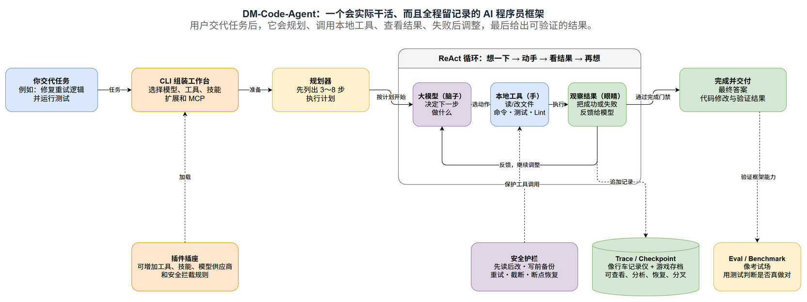
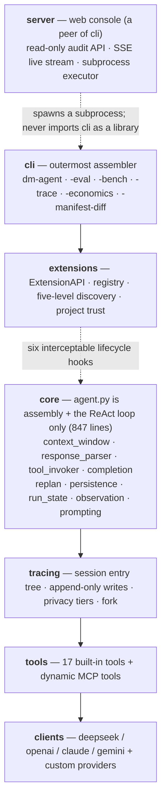

# DM-Code-Agent

<div align="center">

**Local-first · Fully auditable · The kernel is just one ReAct loop**

[](https://github.com/hwfengcs/DM-Code-Agent/actions/workflows/ci.yml)
[](tests/)
[](https://www.python.org/downloads/)
[](LICENSE)
[](https://github.com/hwfengcs/DM-Code-Agent/stargazers)
[](https://github.com/hwfengcs/DM-Code-Agent/commits/main)
[](docs/)
[](docs/research-log/)

[中文](README.md) | **English**



</div>

A Python code agent you can actually **read, reproduce, and extend**. It runs in your local
workspace — reading and writing files, running tests and linters, calling MCP tools — and
records every plan, tool call, and observation into an **append-only session log**. When
something goes wrong you can replay it, diagnose it, and **fork a new run from any single step**.

Not another chat black box: the kernel is just the ReAct loop (847 lines), while optional
capabilities are extensions hanging off lifecycle hooks, and context compaction
**never deletes history** — so ablation conclusions can actually be verified.

> If this project is useful to you, a ⭐ helps others find it.

---

## ⚡ 60-second start

```bash
git clone https://github.com/hwfengcs/DM-Code-Agent.git && cd DM-Code-Agent
uv sync --frozen --extra dev        # or: pip install -e ".[dev]"
cp .env.example .env                # add at least one API key
```

```bash
# Run a task and keep an auditable session log
dm-agent "Fix the retry boundary in retry.py and run the tests" \
  --trace sessions/fix.jsonl --show-steps

# Diagnose that run: which step failed, did it replan and recover, did it skip verification
dm-agent-trace analyze sessions/fix.jsonl
```

**Try before you pay**: tests, deterministic evals, and benchmark manifest checks need
**no API key at all**.

```bash
python -m pytest && python -m dm_agent.evals.cli --variant full --task direct_finish
```

Prefer a browser:

```bash
dm-agent-web --read-only            # Read-only gallery: audit sessions, no API key
dm-agent-web                        # Full workbench: launch tasks + watch every step
```

The terminal prints a tokenized URL — just open it. See [Web console](docs/web.md).

---

## ⭐ Seven things you won't find elsewhere

### 🌳 Run history is a tree that never deletes anything

Most agents compact context by throwing history away, leaving nothing to audit. Here every
entry carries an `id` and a `parent_id`, and compaction only **appends** a derived
"I compacted" record — **not one original message is removed**. So you get:

```bash
dm-agent-trace view       sessions/fix.jsonl    # human-readable timeline
dm-agent-trace analyze    sessions/fix.jsonl    # failure stage / recovery / verification gap
dm-agent-trace diff       a.jsonl b.jsonl       # compare two runs
dm-agent-trace fork       sessions/fix.jsonl --at 4f4bdeee-0007   # branch from entry 7
dm-agent-trace replay     sessions/fix.jsonl    # explicit tool replay
dm-agent-trace analyze-dir sessions/             # aggregate across a directory
```

### 📉 Compaction has a net-benefit guard and rolls back when it loses

Compaction is **locally deterministic** (Mem0-style atomic memory) — it does not burn an extra
LLM call. More importantly it does the math: a candidate is committed only when
`estimated_tokens_after < estimated_tokens_before`, and **a candidate with no gain is rolled
back completely** (memory, cadence, and summary state all restored). A compaction proven to pay
off is reused stickily across requests and across runs, with `phase=sticky_reuse` written into
the trace so reuse is never counted as a fresh compaction.

### 🖥️ Audit in the browser — and the read-only gallery is shareable as-is

```bash
dm-agent-web --read-only     # Read-only gallery: no API key, audits but never launches
dm-agent-web                 # Full workbench: launch tasks + watch every step over SSE
```

Five views, one question each: **Session library** (which runs succeeded — and **which
succeeded with an unhealthy process**), **Run detail** (what every step did; select an entry
for its full payload), **Diagnostics** (which stage failed, did it recover, did it skip
verification), **Compaction** (how many tokens were saved, plus the skipped originals —
**not one of them deleted**), and **Behavior diff** (at which step two runs diverged).

Three boundaries keep it from becoming a second source of truth:

- **Live runs and historical traces share one renderer** — they are the same append-only JSONL
  to begin with. What you watch live and what you audit afterwards cannot disagree.
- **The frontend computes no conclusions.** Failure stage, health score, and verification gaps
  all arrive precomputed from `dm_agent.tracing`, the same source as `dm-agent-trace analyze`;
  `tests/test_server_readonly.py` compares the API response field by field against calling that
  pure function directly, so the server layer cannot drift by computing its own.
- **Launching a run spawns a CLI subprocess** (`python -m dm_agent.cli`) rather than assembling
  a second `ReactAgent` inside the service. The console always does what the CLI does.

The read-only gallery uses hash routing and `base: './'`, so dropping the build output next to
your session JSONL on any static host just works — **no backend, no API key**. Details in
[Web console](docs/web.md).

### 🔌 Add tools / guards / providers without touching a single kernel line

Drop in a `.py` that exports `setup(api)`. Four registration methods
(`register_tool` / `register_skill` / `register_provider` / `on`) plus
**six interceptable lifecycle hooks**:

| Hook | What you can do |
| --- | --- |
| `before_tool_call` | Rewrite arguments, or return `{block, reason}` to stop a dangerous call |
| `after_tool_result` | Middleware-style rewriting of the observation |
| `before_llm_request` | Rewrite messages before they reach the model |
| `before_finish` | Veto a premature "I'm done" |
| `on_run_start` / `on_run_end` | Adjust metadata / append a prompt / `{retry: True}` for another attempt |

[`examples/block_dangerous_shell.py`](examples/block_dangerous_shell.py) is a runnable 25-line
example that blocks `rm -rf`. Discovery has five priority levels (builtin → entry_points →
user directory → project directory → `--extension`), and **project-local extensions require
explicit trust** before they load.

### 🛡️ Guardrails default ON, behavior defaults OFF

This classification is written into the project's constitution, not decided ad hoc:

| Default **ON** (infrastructure guardrails) | Default **OFF** (behavior / algorithms) |
| --- | --- |
| read-before-edit guard, observation truncation, token-budget compaction | Adaptive replanning (error signals → replan strategy) |
| Atomic writes + automatic backups, unified LLM retry | |
| `--checkpoint` / `--resume` run-level resumption | |

New users get a **safe** default configuration; researchers flip one `--enable-xxx` at a time
to run a clean ablation.

v2.1 did a round of subtraction: six default-off modules whose graduation criteria depended on
the frozen real evaluation were removed (Reflexion / Critic / Self-Consistency / circuit breaker /
memory hygiene / LLM compression). CLI flags went 35 → 23. To revive any of them, write it as an
external extension — that is precisely what the extension system is for.

### 🔬 Full verification with no API key

| | |
| --- | --- |
| Unit tests | **427 cases**, 10.3k lines of test code (20.1k lines of backend source + 3.6k of frontend) |
| Deterministic evals | 14 tasks × 4 variants, driven by a scripted client, **zero network calls** |
| Frontend | vitest covers the presentation-layer pure functions; CI rebuilds and **byte-compares** the committed bundle |
| CI matrix | Ubuntu + Windows × Python 3.10 / 3.11 / 3.12 — **6 combinations** |
| Quality gates | ruff (`E F I UP B SIM TID RUF`) + black + mypy + `uv lock --check` + pre-commit |
| Layering contract | `clients → tools → tracing → core → extensions → cli`, enforced by ruff `TID251` in CI |

"Minimal kernel" is a number you can check, not a slogan: `agent.py` 1774 → **847** lines,
`main.py` 2048 → **6** lines, `tracing/cli.py` 1111 → **171** lines.

### 🧪 No inflated scores

**This project never claims an evaluation improvement it has not actually run.** Real
SWE-bench / Docker Tier-2 verifier / cross-model scoring are **frozen**, and the SWE-bench Lite
suite was removed in v2.1 because it did not work: the Tier-1 baseline was 0.0% resolved and
polluted by host verifier noise, and the Tier-2 verifier was never implemented.

The scoreboard is now the bundled **coding + maintenance benchmark**: 13 tasks judged pass/fail
by hidden tests, with no Docker or HuggingFace dependency. Measured: DeepSeek scores
`pass_rate 0.5 (3/6)` on the coding suite.

```bash
dm-agent-bench --suite all --provider deepseek --output bench_reports/after.json
dm-agent-score-diff bench_reports/before.json bench_reports/after.json
```

It reports **which tasks flipped in each direction**, not just the total — regressions are listed
separately even when the total goes up. At 13 tasks one flip is ±7.7 percentage points, and that
noise floor is printed in the output so a single-task swing is not misread as an improvement.
Full caveats in [project status](docs/project-status.md).

---

## 👀 What a real run looks like

The output below is **actually generated** (the `tool_failure_replan` deterministic eval task,
no API key needed) — a failed read triggers a replan, which then completes via another path:

```console
$ dm-agent-trace view sessions/demo.jsonl
Trace run: 4f4bdeee197d415e8fc8992c227605f9
Task: If reading missing.txt fails, create recovered.txt instead.
Status: success
Provider: deepseek
Model: deepseek-chat
Events: 22
Steps: 3

1. read_file -> 文件 missing.txt 不存在。
2. create_file -> 已将 24 个字符写入 recovered.txt。
3. task_complete -> 任务完成：recovered

Final: 任务完成：recovered
```

`analyze` doesn't just say it succeeded — it **calls out the corner it cut**: this run declared
completion without running any verification.

```console
$ dm-agent-trace analyze sessions/demo.jsonl
Trace analysis
Status: success
Primary failure stage: tool
Final failure stage: none
Recovery: failures=1, replans=1, replanned_after_failure=true, recovered=true
Verification: actions=0, before_finish=false, gap=true
Hallucination signals: edit_without_read=0, guard_blocks=0, truncations=0, missing_paths=1
Health: warning (0.80)
Issues:
- verification_gap
```

That's what "auditable" means here: **a successful task is not the same as a healthy process**,
and the difference is machine-readable.

---

## 🏗️ Architecture at a glance


```mermaid
flowchart TD
    WEB["<b>server</b> — web console (a peer of cli)<br/>read-only audit API · SSE live stream · subprocess executor"]
    CLI["<b>cli</b> — outermost assembler<br/>dm-agent · -eval · -bench · -trace · -economics · -manifest-diff"]
    EXT["<b>extensions</b> — ExtensionAPI · registry · five-level discovery · project trust"]
    CORE["<b>core</b> — agent.py is assembly + the ReAct loop only (847 lines)<br/>context_window · response_parser · tool_invoker · completion<br/>replan · persistence · run_state · observation · prompting"]
    TRACING["<b>tracing</b> — session entry tree · append-only writes · privacy tiers · fork"]
    TOOLS["<b>tools</b> — 17 built-in tools + dynamic MCP tools"]
    CLIENTS["<b>clients</b> — deepseek / openai / claude / gemini + custom providers"]

    WEB -. "spawns a subprocess; never imports cli as a library" .-> CLI
    CLI --> EXT
    EXT -. "six interceptable lifecycle hooks" .-> CORE
    CORE --> TRACING --> TOOLS --> CLIENTS
```

Dependencies flow **one way only** (`clients → tools → tracing → core → extensions → cli`),
enforced by ruff `TID251` in CI — a `core` module importing `cli` fails the build.
`server` is a peer of `cli`: it spawns CLI subprocesses, so the web UI can only ever do what
the command line does — an invariant held by AST assertions in `tests/test_server_layering.py`.
The authoritative prose version is [docs/architecture.md](docs/architecture.md).

---

## 📊 v.s. similar projects

| Dimension | DM-Code-Agent | Aider | OpenHands | SWE-agent | smolagents |
| --- | --- | --- | --- | --- | --- |
| Local-first (no sandbox dependency) | ✅ | ✅ | docker | docker | ✅ |
| Session log + replay | ✅ JSONL entry tree + dry/tool replay + diff + fork | git diff | server log | trajectory | weak |
| Non-destructive context compaction | ✅ originals kept, recomputable offline | repo-map | partial | trajectory | weak |
| Extension system (add capabilities without kernel edits) | ✅ entry_points + directories + explicit file | ❌ | plugins | ❌ | ❌ |
| Interceptable lifecycle hooks | ✅ 6 events | ❌ | partial | ❌ | ❌ |
| Visual audit console | ✅ read-only gallery, no key, static-hostable | chat GUI | ✅ full web UI | trajectory inspector | ❌ |
| MCP integration | ✅ | ❌ | ✅ | ❌ | ❌ |
| Bundled hidden-test benchmark | ✅ 13 tasks, scored | ❌ | ❌ | SWE-bench | ❌ |
| Published SWE-bench Lite score | ❌ removed (did not work, see above) | ❌ | ✅ | ✅ | ❌ |
| License | MIT | Apache-2.0 | MIT | MIT | Apache-2.0 |

Comparison protocol, module status, and roadmap: [project status](docs/project-status.md).

---

## 📚 Documentation

Start at **[docs/](docs/)** for the full index. The six you will want first:

| Document | When to read it |
| --- | --- |
| [Getting started](docs/getting-started.md) | Install, configure, first task, local checks |
| [CLI reference](docs/cli.md) | Seven entry points, every flag and its default |
| [Web console](docs/web.md) | Session audit, live runs, security model, static hosting |
| [Architecture](docs/architecture.md) | Layering, execution chain, hook points, session model |
| [Extensions](docs/extensions.md) | Add tools / guards / providers without kernel edits, plus the security model |
| [Sessions and traces](docs/tracing.md) | Session tree, privacy tiers, checkpoints, fork |

Motivation, experiments, and dead ends for every non-trivial design decision live in
[`docs/research-log/`](docs/research-log/) (32 entries).

> Pages under `docs/` are maintained in Chinese only. This README is the English entry point.
> Issues and PRs in English are welcome.

---

## 🤝 Contributing

Issues and PRs are welcome. Read [CONTRIBUTING.md](CONTRIBUTING.md), [AGENTS.md](AGENTS.md),
[SECURITY.md](SECURITY.md), and [CODE_OF_CONDUCT.md](CODE_OF_CONDUCT.md) first. Changes
involving an algorithmic decision or a non-trivial ablation should come with a devlog entry
under [`docs/research-log/`](docs/research-log/).

**Adding a built-in tool** touches exactly one place: `dm_agent/tools/__init__.py:_builtin_tools()`.
**Adding a third-party extension** doesn't touch the repo at all — see
[Extensions](docs/extensions.md).

## ⭐ Star History

[](https://star-history.com/#hwfengcs/DM-Code-Agent&Date)

## License

MIT License. See [LICENSE](LICENSE).
