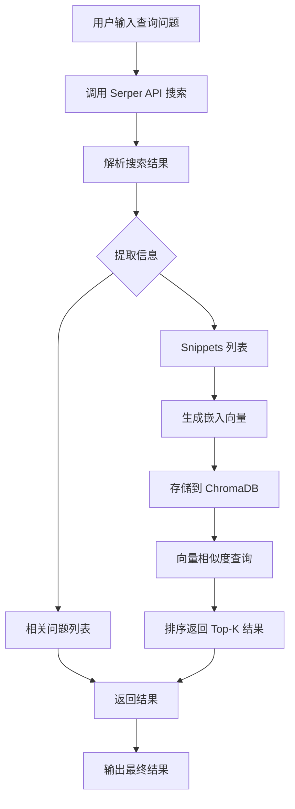
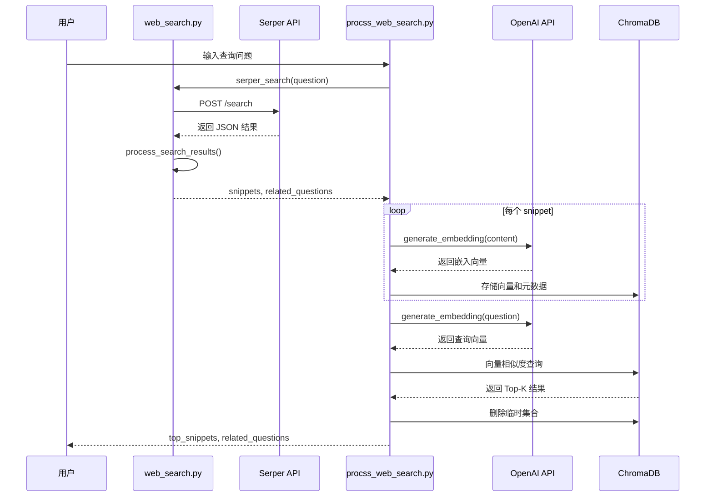
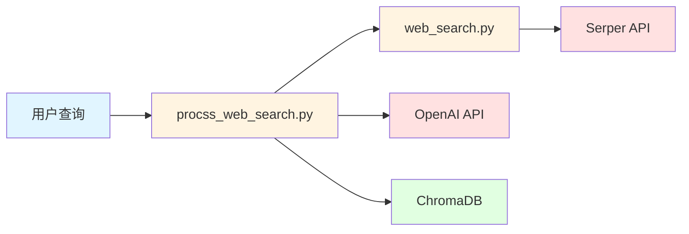
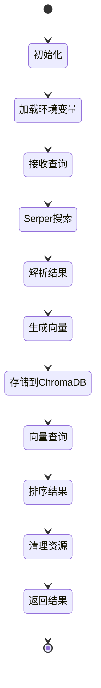

# 网页搜索模块架构文档

## 概述

本模块实现了一个智能网页搜索系统，结合了传统的搜索引擎 API（Serper）和向量数据库（ChromaDB），通过语义相似度匹配提供更精准的搜索结果。

## 模块结构

```
web_search/
├── __init__.py              # 模块初始化文件
├── web_search.py            # 基础搜索功能和结果处理
└── procss_web_search.py     # 高级搜索处理（向量化存储和查询）
```

## 核心组件

### 1. 基础搜索模块 (web_search.py)

**功能职责：**
- 与 Serper API 交互，执行网页、图片、视频搜索
- 处理和解析搜索结果
- 提取关键信息（snippets 和相关问题）

**核心函数：**

| 函数名 | 功能 | 参数 | 返回值 |
|--------|------|------|--------|
| `serper_search()` | 常规网页搜索 | q, hl, num | dict |
| `serper_images()` | 图片搜索 | q, hl | dict |
| `serper_videos()` | 视频搜索 | q, hl | dict |
| `make_request()` | 通用 API 请求 | q, hl, endpoint, num | dict |
| `process_search_results()` | 处理搜索结果 | search_results | tuple(snippets, questions) |

### 2. 高级搜索处理模块 (procss_web_search.py)

**功能职责：**
- 生成文本嵌入向量（使用 OpenAI Embeddings API）
- 向量化存储搜索结果到 ChromaDB
- 基于语义相似度查询最相关的结果

**核心组件：**

#### 嵌入向量生成
- **API**: 阿里云灵积（DashScope）兼容 OpenAI 接口
- **模型**: text-embedding-v3
- **维度**: 1024 维
- **格式**: float

#### 向量数据库
- **类型**: ChromaDB（内存模式）
- **集合名称**: temp_snippets（临时集合）
- **存储内容**: 搜索结果的 content 字段
- **元数据**: title, url

#### 核心函数

| 函数名 | 功能 | 参数 | 返回值 |
|--------|------|------|--------|
| `generate_embedding()` | 生成文本嵌入向量 | text, api_key, base_url, model_name, dimensions, encoding_format | List[float] |
| `store_and_query_snippets()` | 存储和查询 snippets | question, top_k | tuple(top_snippets, related_questions) |

## 工作流程

### 整体流程图



### 详细执行流程



## 数据流

### 搜索结果数据结构

```json
{
  "organic": [
    {
      "title": "网页标题",
      "link": "https://example.com",
      "snippet": "网页摘要内容"
    }
  ],
  "peopleAlsoAsk": [
    {
      "question": "相关问题"
    }
  ]
}
```

### 处理后的数据结构

**Snippet 格式：**
```json
{
  "title": "网页标题",
  "url": "https://example.com",
  "content": "网页摘要内容"
}
```

**ChromaDB 存储格式：**
- **documents**: [snippet.content]
- **metadatas**: [{"title": snippet.title, "url": snippet.url}]
- **ids**: [唯一标识符]

## 技术栈

| 组件 | 技术/服务 | 用途 |
|------|-----------|------|
| 搜索引擎 | Serper API (Google) | 提供网页、图片、视频搜索 |
| 嵌入模型 | OpenAI text-embedding-v3 | 生成文本向量表示 |
| 向量数据库 | ChromaDB | 存储和检索向量数据 |
| HTTP 客户端 | http.client | 发送 API 请求 |
| 环境管理 | python-dotenv | 加载环境变量 |

## 配置要求

### 环境变量

```bash
# Serper API 密钥
SERPER_API_KEY=your_serper_api_key

# 阿里云灵积 API 密钥（用于嵌入向量生成）
DASHSCOPE_API_KEY=your_dashscope_api_key
```

### API 端点

- **Serper API**: `https://google.serper.dev`
- **OpenAI 兼容 API**: `https://dashscope.aliyuncs.com/compatible-mode/v1`

## 使用示例

### 基础搜索

```python
from dm_agent.web_search.web_search import serper_search, process_search_results

# 执行搜索
results = serper_search(q="人工智能", hl="zh-cn", num=20)

# 处理结果
snippets, questions = process_search_results(results)

# 使用结果
for snippet in snippets:
    print(f"标题: {snippet['title']}")
    print(f"链接: {snippet['url']}")
    print(f"内容: {snippet['content']}")
```

### 高级语义搜索

```python
from dm_agent.web_search.procss_web_search import store_and_query_snippets

# 执行语义搜索
question = "什么是机器学习？"
top_snippets, related_questions = store_and_query_snippets(
    question=question,
    top_k=5
)

# 输出最相关的结果
for idx, snippet in enumerate(top_snippets, 1):
    print(f"\n[{idx}] {snippet['title']}")
    print(f"URL: {snippet['url']}")
    print(f"内容: {snippet['content']}")
```

## 架构优势

1. **双层检索机制**
   - 第一层：传统关键词搜索（Serper API）
   - 第二层：语义相似度匹配（ChromaDB）

2. **灵活性**
   - 支持多种搜索类型（网页、图片、视频）
   - 可配置的返回结果数量
   - 支持多语言搜索

3. **智能化**
   - 基于向量语义的相似度匹配
   - 自动提取相关问题
   - 动态排序结果

4. **资源管理**
   - 使用内存模式，快速访问
   - 临时集合机制，避免数据累积
   - 自动清理资源

## 性能特点

- **搜索速度**: 依赖 Serper API 响应时间
- **向量化**: 每个文本生成 1024 维向量
- **查询效率**: ChromaDB 内存模式，毫秒级响应
- **内存占用**: 临时存储，查询后立即释放

## 扩展方向

1. **持久化存储**: 将 ChromaDB 改为持久化模式，缓存历史搜索
2. **多模态搜索**: 扩展图片、视频的语义搜索
3. **结果聚合**: 整合多个搜索引擎的结果
4. **智能缓存**: 基于查询相似度的结果缓存
5. **自定义排序**: 结合用户偏好和点击率优化排序

## 注意事项

1. **API 密钥**: 确保配置正确的 API 密钥
2. **速率限制**: 注意 Serper API 和 OpenAI API 的调用限制
3. **内存管理**: ChromaDB 使用内存模式，大数据量时注意内存占用
4. **错误处理**: 网络请求和 API 调用需要适当的异常处理
5. **编码格式**: 确保文本编码为 UTF-8

## 依赖关系图



## 模块交互流程



---

**文档版本**: 1.0  
**最后更新**: 2026-03-04  
**维护者**: DM-Code-Agent Team
